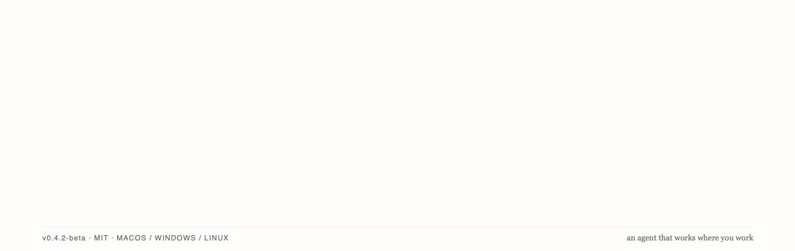
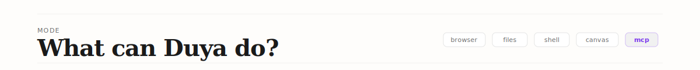
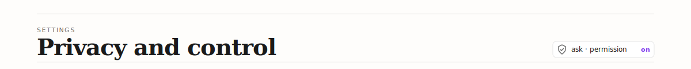
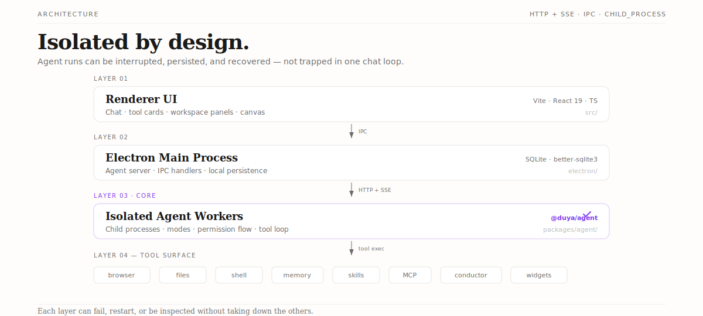

<p align="center">
  
</p>

<p align="center">
  <a href="https://github.com/lava-chen/duya/releases">
    
  </a>
  <a href="LICENSE">
    
  </a>
  <a href="https://github.com/lava-chen/duya/actions">
    
  </a>
</p>

> Duya is in public beta. It is usable, but still rough. Expect fast iteration, visible bugs, and frequent release notes.

**Duya is a local-first desktop AI agent.** It brings agent workflows into a desktop workspace where the agent can browse the web, read and edit files, run terminal commands, manage project references, and render visual artifacts — with every sensitive action visible and permission-based.

The goal is not blind autonomy. It is **controlled agency**.

---

## Demo

A good first task looks like this:

```text
Research how local-first AI agents are different from cloud agents.
Use the browser to collect sources, then create a markdown note in this project.
```

Duya will open the browser, search and navigate pages, capture what it finds, ask before writing files, and leave a cited note in your workspace — all inside the desktop app.

---

## Why Duya?

Most AI agent tools fall into one of three buckets:

- **Terminal agents** are powerful, but intimidating for non-developers.
- **Chat assistants** are easy to use, but cannot really operate inside your local workspace.
- **Cloud agents** can run long tasks, but often hide execution details and move sensitive work away from your computer.

Duya takes a different path: a desktop app that gives the agent real local tools while keeping every action visible, inspectable, and permission-gated.

---



### Research with a real browser

Duya can open pages, click elements, type into inputs, scroll, manage tabs, capture screenshots, and read network output. Useful when research means interacting with the web like a user, not just calling a search API.

### Work with local files

Read, search, write, and edit files in your workspace. Supports standard agent coding tools such as `read`, `grep`, `glob`, `edit`, `write`, `bash`, and `PowerShell`. Generated or modified files can be opened directly from tool cards.

### Use project references

Curate files that matter to the agent — project notes, `.duya` files, `.agents` files, `.claude` files, design docs, or task context — so the agent uses them as working context instead of guessing from scattered files.

### Run terminal workflows

Run shell commands when permitted, inspect outputs, and use terminal results as part of the task loop. Sensitive commands can be permission-gated.

### Continue instructions during a run

Send follow-up instructions into an active task instead of waiting for the whole run to finish. The Agent Mailbox model makes long-running tasks easier to steer.

### Create visual artifacts

Render widgets, diagrams, dashboards, charts, and mini visualizations inside the chat. Generated widgets pass through a visual self-review pipeline so the agent can inspect and improve the rendered result.

### Use Conductor canvas workflows

An experimental canvas mode supports elements, smart layout, viewport-aware packing, alignment-first snapping, collision handling, and agent-driven canvas operations.

---

## Quick start

1. **Download** the latest beta from [Releases](https://github.com/lava-chen/duya/releases).
2. **Install** the package for your platform:

| Platform | Installer |
| -------- | --------- |
| Windows  | `.exe` |
| macOS    | `.dmg` |
| Linux    | `.AppImage` |

3. **Configure a model provider** in the app. Duya supports multi-provider setups. Your API key is stored locally with OS-level protection and masked in the UI.
4. **Run a first task:**

```text
Use the browser to research one topic and create a markdown note.
```

```text
Read this project folder and summarize what the project does.
```

```text
Inspect this small codebase, run tests if needed, and suggest one safe fix. Ask before editing files.
```

---



Duya is designed as a local-first desktop app:

- Conversations and workspace data are stored locally by default.
- You choose your model provider and API key.
- Tool actions are rendered as visible tool cards.
- Sensitive actions can require explicit approval.
- Provider credentials are masked in the UI.
- Local persistence keeps sessions, tool outputs, and task state independent of any single process.

---

## Architecture



Duya separates the UI, Electron main process, local persistence, and isolated agent runtimes:

```text
Renderer UI
  ↕
Electron Main Process
  ↕
Agent Server / IPC / SQLite
  ↕
Isolated Agent Worker Processes
  ↕
Tools: browser, files, shell, memory, skills, MCP, conductor
```

Core stack: Electron, Vite, React 19, TypeScript, SQLite / better-sqlite3, HTTP + SSE, and child-process agent workers.

This structure is designed so agent runs can be isolated, persisted, interrupted, and recovered more reliably than a single in-process chat loop.

---

## Development

```bash
npm install
npm run electron:dev   # desktop app in development
npm run electron:build # production build
npm run typecheck:all  # run before committing
npm run test           # unit tests
```

Other useful scripts:

```bash
npm run build:agent
npm run bundle:agent
npm run electron:pack
npm run electron:verify:packaged
npm run diagnose:env
```

### Repository structure

```text
src/                  Renderer UI
electron/             Electron main process, IPC, local services
packages/agent/       Agent runtime, tools, prompts, modes
packages/cli/         Desktop control-plane CLI
packages/conductor/   Canvas / conductor subsystem
packages/gateway/     External channel gateway package
scripts/              Build, bundle, packaging, diagnostics
docs/                 Architecture, execution plans, release notes
```

---

## Current beta status

Recently landed: multi-provider architecture, Agent Mailbox, typed permission flow, Codex-aligned chat composer, right-side workspace panel, Office/notebook previews, terminal panel, project references, plugin/skill/MCP layer, CLI control plane, widget rendering, Conductor canvas smart layout, and a stability audit across the agent core and tools.

Known caveats: onboarding needs real-user testing, some workflows are rough or experimental, macOS and Linux packages need more smoke testing, and enterprise workspace features are not the current public-beta focus.

---

## License

MIT