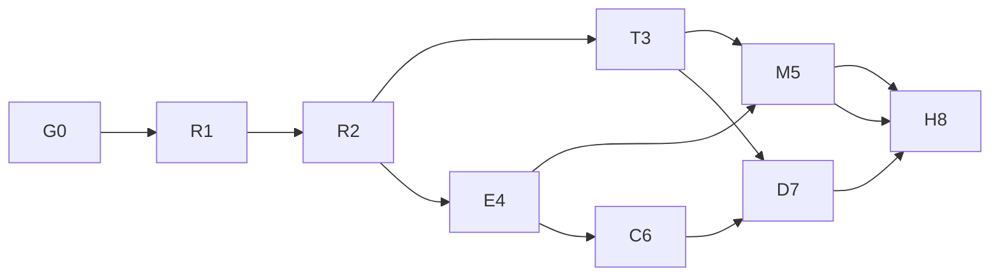

# 587 — Agent Harness / Monorepo 架构重构主计划

> Status: Active — G0.1 取证完成（G0 未验收）；runtime phases not accepted.
> Created: 2026-10-03. Priority: P0. 唯一执行队列：本文件。
> Current task: **G0.2** — 把 `architecture:check` 接入独立可读 CI job，并解除 `build` job 对 `needs: test` 的整job依赖。
> G0.1 已建立按 (file, test, signature) 的可比失败集合；`npm ci` 在本机因 node-pty MSB8040 未取得 exit 0，属环境阻塞，已具名留开。
> 本次交付为完整计划整合；不代表运行时修复或架构迁移已经完成。

## 1. 执行 agent 从这里开始

1. 读仓库 `AGENTS.md`、[项目索引](../../README.md) 的 Verified baseline、`ARCHITECTURE.md`。
2. 读本文件、[合同](00-contracts.md)、当前任务对应阶段文件；无需逐篇读历史方案。
3. 核对当前源码、Git/PR、测试与共享状态。文档中的已落地记录不是当前正确性的替代证据。
4. 领取下表唯一 Ready 阶段的第一个未完成任务；跨阶段接口以 00 为准。遇到已有工作先衔接，不能另写同一修复。
5. 实施前写窄范围变更清单；大型/跨模块迁移按仓库 worktree → PR 流程，避免覆盖脏主检出。
6. 完成任务后更新阶段 checkbox 和 [执行日志](11-execution-log.md)，附 commit、验证命令/结果、限制、下一任务；阶段门槛满足才推进主表。

任何 agent 都不应从历史文件的旧 M/PP/C 编号自行排期。历史文件保留取证，**587 的编号、合同和阶段门槛接管实施**。修改合同需更新受影响测试与接管映射。

## 2. 交付目标与边界

交付能够被 Desktop、CLI、automation/workflow 及 evals 共同消费的 run 引擎：输入与身份明确，执行有唯一控制入口，预算/取消/审批可靠，持久化结果可信，可在声明支持的边界恢复，工具副作用可对账。

本主线接管 429、550、583、584、585、586 与 Workspace Phase 0；整合 MONOREPO_RFC 和 architecture 系列的重构规划。已实现代码保留，未验收事项不沿用旧勾选。独立产品计划通过 [依赖与接管表](10-legacy-crosswalk.md) 协调；不把 UI/Bot 功能混进拆包提交。

不提前建立通用 tools/memory/storage/ui 包，不整体改名 conductor，不把 Session 改成外部 Channel，不重建 Project identity，不承诺任意外部工具 exactly-once，不开放未实现 capability。

## 3. 主阶段与唯一 Next action

| 阶段 | 状态 | 前置 | 本阶段下一任务 | 完成证据 |
| --- | --- | --- | --- | --- |
| G0 [基线与治理](01-baseline-and-gates.md) | **In progress** | — | G0.2 architecture:check 独立 job + 解除 build 的 needs:test | clean build、可信 required gate、失败债可辨别 |
| R1 [Run 结果与存储](02-run-correctness.md) | Pending（R1.1回归测试已预备，未合入） | G0 | R1.1 将四个探针转成故障回归测试 | result 等待，durable barrier，ack/CAS确认 |
| R2 [真实 worker 控制](03-worker-control.md) | Pending | R1 | R2.1 做 adapter 接入清单及单入口切换 | canonical ID、真实输入、dispatch/stop/审批/预算 |
| T3 [协议与事件传输](04-protocol-and-streams.md) | Pending | R2 | T3.1 wire 数据与内部对象分层 | 同一 seq/cursor、lossless兼容、背压、capability |
| E4 [行为基准与 evals](05-behavior-and-evals.md) | Pending | R2；传输比较需T3 | E4.1 真实旧worker+offline provider闭环 | 故障、工具、mode、mailbox、Desktop证据 |
| M5 [包与 host 迁移](06-package-and-host-migration.md) | Pending | G0、T3、E4 | M5.1 当前依赖与切片清单 | 纯 core、可执行 runtime、host contracts与迁移归零 |
| C6 [ControlPlane / Workspace](07-control-plane-and-workspace.md) | Pending | R2、E4；整体替换需M5 | C6.1 repository/approval/scheduler owner接管 | 跨run协调、durable Workspace、Project兼容迁移 |
| D7 [恢复与长期工作](08-recovery-and-long-running.md) | Pending | T3、C6 | D7.1 checkpoint/副作用状态机 | kill/restart恢复、lease/fence、安全重试 |
| H8 [多 host 与退役](09-headless-and-retirement.md) | Pending | M5、C6、D7 | H8.1 headless composition / host验收 | CLI/automation共用API；旧agent退役；打包smoke |

设计、夹具和无冲突的纯叶子预备工作可以提前准备；**前置没有通过时不切换生产路径，也不把阶段标成完成**。E4 的运行行为测试可以在 T3 完成前启动。C6 的纯 resolver/模型设计可与 M5 的无交集切片交错，不并行修改同一 owner。

## 4. 阶段实现文件与支持资料

- [00 合同与已定决策](00-contracts.md)：包/进程边界、状态与取消、Workspace、审批、seq、secret、兼容策略。
- [迁移映射](migration-map.md)：旧 agent 全模块、Electron 区域和目标职责；每个切片的端口与退出条件。
- [接管映射](10-legacy-crosswalk.md)：旧 PP/M/C、550 子任务、583 ISS、429 和关联计划的唯一归属。
- [执行日志](11-execution-log.md)：阶段证据、阻塞与handoff模板。下一步必须可执行。
- [历史资料索引](reference/README.md)：旧设计和评审，仅用于证据；不能覆盖合同。
- [旧计划索引](history/README.md)：原文完整保留，状态 superseded，不表示旧任务全部完成。

## 5. 统一 PR 与验收纪律

一个 PR 一个逻辑切片；不把类型移动、协议行为变更、schema收缩混在一批。每个 PR 都写明旧调用 → 新调用、真实消费者、回退开关、旧 shim 删除条件。

共用检查：`npm run typecheck:all`、`npm run architecture:check`、针对变更的有意义测试。审计 resolver 改动补 `architecture:self-test` 并审查 baseline diff；main/preload 改动补 `npm run build:electron` 和桥接测试；模块/打包边界改动在 push 前 `npm run electron:build`。UI 改动必须 Playwright，preload行为必须真实Electron。

完整测试存在既有失败。G0 记录路径/测试名/错误签名，后续比较集合；新增失败不能称作历史债。不要用总数相同证明没有回归，不将跳过或取消记为通过。类型检查暖构建、干净检出、跨平台CI分别记录。

合同断言使用代码和故障注入，不测试文档自己的说法。纯移动采用原有行为夹具；provider实测只作额外smoke，不拿它替代确定的离线回归。

## 6. 恢复、回退和删除

迁移期只有一个执行 owner，观察 shadow 可以存在，第二个 executor 不可以。新路径先 feature switch，旧 adapter保留明确期限；开关不得绕权限。数据库 additive expand/contract，旧reader兼容窗口和备份先验证，不能把git revert当数据回滚。

阶段日志记录“路由回退后存储如何读”“已经发生的外部动作如何对账”。审批、外部写入和已提交终态不因代码回退消失。legacy exports 删除必须满足消费者归零、打包/hostsmoke和兼容窗口证据。

## 7. 完成定义

- [ ] R1/R2：一个真实 run 有唯一 ID/dispatch/终态，读取不改变执行，取消/预算/审批生效。
- [ ] T3/E4：三种adapter共享行为合同，重连与慢消费者正确，真实worker回归和Electron证据完整。
- [ ] M5：core无外部IO、runtime无Electron/renderer；迁移清单逐项完成，旧包仅兼容且最终删除。
- [ ] C6/D7：跨run协调、Workspace/Project兼容、checkpoint及副作用恢复经过故障注入。
- [ ] H8：多host共用API，cleanCI和packagedsmoke有证据，unsupported能力仍关闭。
- [ ] 全部旧任务有完成证据或明确非阻塞后续归属，没有第二套执行队列。
- [ ] 更新ARCHITECTURE及项目索引；计划目录整体移入completed，主Active row删除，所有入口同步。

本文件当前只完成计划收敛；上面各项由后续执行agent逐项验收。
