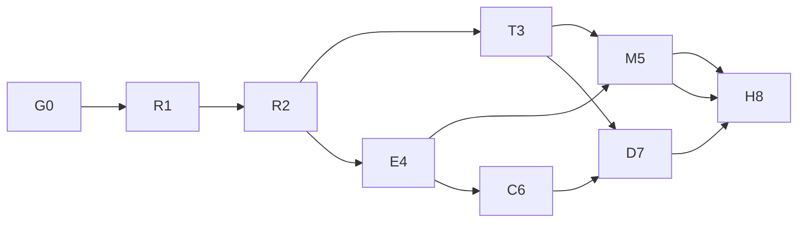

# 587 — Agent Harness / Monorepo 架构重构主计划

> Status: Active — R1 与 T3 完成；R2、M5、C6、D7 全部切片已合并但各有自评 partial 余项；E4 停在 E4.4（四条都有证据，无一条验收）；**H8.1 已由 #198 合并进 master，#178 已 CLOSED 且从未合并**；**H8.2 的 automation 一项已由 #205 闭合（改读 `RunResult`），subagent 与 workflow 仍未迁**。G0 的门禁债仍在收敛，测试门禁按设计仍然红。
> Created: 2026-10-03. Priority: P0. 唯一执行队列：本文件。
> Current task: **H8.2 的 subagent child run**——缺的是 **worker→CP 的开 run 通道**（`parentRunId` 已端到端就位），且进度/后台续跑/`subagent:kill` 三样可观测合同都要改挂到 run id；workflow 跟着它一起动。并行走一条：在有空间的机器上真正跑一次 `npm run test:e2e:turn`，它是 E4.4 唯一没被跨过的线。其余阶段只剩各 PR 自评 partial 的余项，**没有一条可以宣称完成**。
> **本表的证据基准**：`origin/master` = `46967fa2`，合并 PR #138–#205（#165/#170 closed-unmerged，**#178 closed-unmerged、被 #198 取代**）。状态与 PR 的对应逐条列在下表"完成证据"列；CI 数字只取 master push 的已结束 run。
> **R1 与 T3 已完成**：R1 四个接缝修复、串行写队列与终态 barrier、typed receipt 与 CAS 对账、结果面区分"无活动"与"未实现"（注入 delay 的有界退避 25ms 翻倍、每 run 500ms 上限，按毫秒设界，因为 `settle` 要等写队列才发布终态）。T3 单一词汇 owner、单一 emit 入口、seq/cursor/replay、coalescing、三 transport。
> **R2/M5/C6/D7 是"切片全合并、余项自评 partial"，不是 Done**：#153 第4项（运行期 catalog 刷新）、#154 第3a/4项（预算抢占、在跑工具）、#155 第5项（cancel 关审批/唯一 deadline）、#169"跨 run start/terminal owner"、#171 S3（CLI contract）、#175（自述"头部迁移未做"）都由交付 PR 自己标注 partial，见各阶段文件的逐条理由。
> **E4.4 四条都有证据、都没有验收**（2026-10-04 对 `2a375c1c` 复核，结论不变）：第1条真实 Electron turn 成立，**两条断言已由 #201 裁定**：末帧那条**测试错**（已改为断言更强的不变量），`assistant.message_finalized` 那条**断言对、产品缺**——**#203 已补上产品缺口**（新增 worker 帧 + 在共享 `translateFrame` 接缝翻译，真实台账 4 行 → 6 行）；**但那份 E2E spec 至今一次都没有被真正执行过**（需真实 `electron:build`，本机磁盘不允许，#201/#203 均明写），**不得读成通过**；第2条 **unsupported**（无 live provider key，离线 provider 按本文件规定不能替代 P6）；第3条 macOS CI **真的产出过 electron-builder 包**且 `afterPack` 校验了包内 agent-bundle 与 BashWorker，**#200 已修好挡住 parity 步骤的 publish 失败**（CI 加 `--publish never`），但打包应用**从未被运行**，`check:packaged-artifacts --packaged` 每次仍打印 `UNVERIFIED`；第4条 #195 三个状态 + 主题共 4 个测试全绿走真实 Electron 桥。
> 已知待决：`better-sqlite3@13` 随 tarball 附带 N-API prebuild → V8-ABI swap 路径可能大部分冗余。
> 本次交付为**计划状态对齐**（只改本目录文档）；不代表运行时修复或架构迁移已经完成。

## 1. 执行 agent 从这里开始

1. 读仓库 `AGENTS.md`、[项目索引](../../README.md) 的 Verified baseline、`ARCHITECTURE.md`。
2. 读本文件、[合同](00-contracts.md)、当前任务对应阶段文件；无需逐篇读历史方案。
3. 核对当前源码、Git/PR、测试与共享状态。文档中的已落地记录不是当前正确性的替代证据。
4. 领取下表唯一 Ready 阶段的第一个未完成任务；跨阶段接口以 00 为准。遇到已有工作先衔接，不能另写同一修复。
5. 实施前写窄范围变更清单；大型/跨模块迁移按仓库 worktree → PR 流程，避免覆盖脏主检出。
6. 完成任务后更新阶段 checkbox 和 [执行日志](11-execution-log.md)，附 commit、验证命令/结果、限制、下一任务；阶段门槛满足才推进主表。

任何 agent 都不应从历史文件的旧 M/PP/C 编号自行排期。历史文件保留取证，**587 的编号、合同和阶段门槛接管实施**。修改合同需更新受影响测试与接管映射。

## 2. 交付目标与边界

交付能够被 Desktop、CLI、automation/workflow 及 evals 共同消费的 run 引擎：输入与身份明确，执行有唯一控制入口，预算/取消/审批可靠，持久化结果可信，可在声明支持的边界恢复，工具副作用可对账。

本主线接管 429、550、583、584、585、586 与 Workspace Phase 0；整合 MONOREPO_RFC 和 architecture 系列的重构规划。已实现代码保留，未验收事项不沿用旧勾选。独立产品计划通过 [依赖与接管表](10-legacy-crosswalk.md) 协调；不把 UI/Bot 功能混进拆包提交。

不提前建立通用 tools/memory/storage/ui 包，不整体改名 conductor，不把 Session 改成外部 Channel，不重建 Project identity，不承诺任意外部工具 exactly-once，不开放未实现 capability。

## 3. 主阶段与唯一 Next action

| 阶段 | 状态 | 前置 | 本阶段下一任务 | 完成证据 |
| --- | --- | --- | --- | --- |
| G0 [基线与治理](01-baseline-and-gates.md) | **In progress** | — | G0.2 合同/迁移测试独立 job（`.github/workflows/test.yml` 现只有 `architecture`/`test`/`build`）；随后才谈 required checks | 可重复基线 #138、文档事实 #139、CI 接线 #140、构建次序 #143、跨平台门禁 #146、G0.3/G0.4 收尾 #148、electron 二进制 #151；CI 债波 A #183–#187、波 B #189/#192、inventory 断言 #193 |
| R1 [Run 结果与存储](02-run-correctness.md)  | **Done**（R1.1–R1.4） | G0 | 无。#168 自评 "closes phase R1" | #147 R1.1、#149 R1.2、#162 R1.3、#168 R1.4 |
| R2 [真实 worker 控制](03-worker-control.md) | **In progress**（R2.1–R2.4 已合并） | R1 | 四条自评 partial：manifest 运行期 catalog 刷新（#153-4）、预算抢占 + 在跑工具（#154-3a/4）、cancel 关审批/唯一 deadline（#155-5） | #150 R2.1、#153 R2.2、#154 R2.3、#155 R2.4 |
| T3 [协议与事件传输](04-protocol-and-streams.md)  | **Done**（T3.1–T3.5） | R2 | 无。**例外**：T3.1 的"可验证兼容发布窗口"对 `private: true` 包不成立，shim 退出条件只能是消费者归零（#156 明确拒绝声称有窗口） | #156 T3.1、#157 T3.2、#158 T3.3、#159 T3.4、#161 T3.5 |
| E4 [行为基准与 evals](05-behavior-and-evals.md)  | **In progress**（E4.1–E4.3 已合并；E4.4 四条均有证据、均未验收） | R2；传输比较需T3 | **跑一次 `npm run test:e2e:turn`**——第1条断言已由 #201 裁定（末帧那条测试错，已改为更强不变量；finalized 那条断言对、产品缺）、产品缺口已由 #203 补齐（census 行从 `NOT YET WIRED` 改为点名两个帧生产者），**但该 spec 一次都没被真正执行**，故第1条仍未验收 | E4.1 #160、E4.3 #163、E4.2 #164、对账 #179、打包门禁 #180/#191、真实 turn #181/#188、namespace 隔离 #190、三状态+主题 #195、**裁定 #201（`d20e31ae`）、接线 #203（`b81b3c64`）、CI publish 修复 #200（`c59b3cfd`）** |
| M5 [包与 host 迁移](06-package-and-host-migration.md)  | **In progress**（M5.1–M5.5 已合并） | G0、T3、E4 | M5.2-S3 CLI contract 拆分（#171 自评 not done）；M5.3 纯岛四项一项未迁；M5.4 头部迁移（#175 自述"not done"） | M5.1 #166、M5.2 #171、M5.5 #172、M5.3 纯度门禁 #173、M5.4 #175；分类更正 #174 |
| C6 [ControlPlane / Workspace](07-control-plane-and-workspace.md)  | **In progress**（C6.1–C6.2 已合并） | R2、E4；整体替换需M5 | C6.1 跨 run start/terminal 单一 owner（#169 自评 partial，只有 HostMap）；C6.3 resolver 五条未开始 | C6.1 #169、C6.2 #176 |
| D7 [恢复与长期工作](08-recovery-and-long-running.md) | **In progress**（D7.1 已合并；D7.2–D7.4 未开始） | T3、C6 | D7.2 lease/fence/recovery attempt——`#177` 只交付 D7.1，resume/determinism/pause 仍显式 unsupported | #177 |
| H8 [多 host 与退役](09-headless-and-retirement.md) | **In progress**（**H8.1 已合并**；H8.2 automation 已闭合，subagent/workflow 未迁） | M5、C6、D7 | H8.2 subagent child run：先开 worker→CP 的 run 通道（worker 的 `db-client` 约 230 个 action 里**一个 `run:*` 都没有**），再把进度投影/后台续跑/`subagent:kill` 三样改挂 run id；workflow 随之 | H8.1 #198（`7b6c7f38`，#178 的重放；#178 本身 CLOSED 未合并）、H8.2 普查+CLI approval #197（`08065a7c`）、符号锚点+退役登记 7→2 #199（`2f797c3e`）、**automation 读 `RunResult` #205（`46967fa2`）** |

### 3.1 表内数字的实测口径

- **CI（唯一可与历史比较的口径，取 master push 的已结束 run）**：`#192`（`1ffabfc9`，run `37194425248`）三OS **collect 完全相同**（1096 文件 / 13016 测试）——ubuntu **19 失败文件 / 42 失败测试**、macos **28 / 80**、windows **13 / 34**。对照 `5dc45fcf`（587 之前，ubuntu 72 / 216）与 `#190`（ubuntu 37 / 66、macos 47 / 105）：**macOS 始终是最差的一条腿**，只在 ubuntu 上验证会少算。`#192` 之后没有已结束的 run，`#195` 的 run `37199119040` 写作时仍在跑。
- **架构门禁（本文件写作时在 `55384c55` 亲自跑，纯 `node` 脚本、不需要 `node_modules`）**：`architecture:self-test` exit 0，460 / 227 / 0 / 146 / 25 / 16 / 0；`architecture:check` exit 0，total **874** = tolerated **874**、baseline **811**、**131** 条基线指纹不再触发。与执行日志在 #191 记录的数字**逐项一致**，没有漂移。
- **架构门禁（2026-10-04 在 `46967fa2` 复跑，仍是纯 `node` 脚本、未安装依赖）**：`architecture:self-test` exit 0 → 460 / **233** / 0 / 146 / 25 / 16 / 0；`architecture:check` exit 0 → total **880** = tolerated **880**、baseline **811**、**131** 条不再触发。**与 `2a375c1c` 上那次逐项一致**——#205 曾把 `module-dependency-permitted` 顶到 234，是**主动退回 233** 的（把协议类型 import 换成运行期收窄，避免重录 ratchet），所以门禁数字没有变。本次文档切片**对门禁贡献为零**（只改 markdown）。
- **本切片亲跑的其他门禁**：`npx vitest run` 三个 H8 门禁文件 **22/22 绿**（`h8-2-consumer-inventory` 7 + `headless-retirement` 7 + `run-entry-single-dispatch` 8）；`cli-approval-safety` **10/10**、`control-plane-census` **73/73**、#205 的 `run-result-read` **5/5**（合计 **105/105**）。**#205 的 `automation-run-result.test.ts` 在本工作树跑不起来**——`packages/plugin-core/dist` 未构建，`@duya/plugin-core/mcp/core/alias` 解析失败，**属于未构建工作树的环境问题（就是那条已知 `pretest`/`bundle:agent` 陷阱），不是测试缺陷**，故本切片对它不作任何断言。工作树无 `node_modules`，但它嵌套在主检出内，Node 解析逐级向上走到主检出的 `node_modules`——**未跑 `npm ci`、未建任何 junction/symlink**。
- **⚠️ 亲跑发现的一处红：`13-citation-drift` 在 `2a375c1c` 与 `46967fa2` 上都红（1 failed / 5 passed of 6，tier-3 锚点检查报**同样 7 条**）**，详见 [01 阶段文件](01-baseline-and-gates.md) 的"引用漂移门禁"条。#202 已把该门禁修成 6/6，但那是它自己的基线 `d20e31ae`；**#203 在同一个合并窗口给 `router.ts` 加了 38 行**，把它重指的每一个 `router.ts:NNNN` 锚点整体推后 **+33**，门禁因此重新变红，且 #205 没有碰这些锚点。**本切片是纯文档，不修它**（修它要改 `packages/agent-protocol/src/**` 的注释）。
- **未跑的**：`npm run architecture:baseline --write` **从未运行**，本切片也没有运行。`typecheck:all` / `npm test` / `npm run electron:build` **本切片未跑**（本切片是纯文档，不安装依赖）。`electron:pack` **本机从未跑过**（磁盘），但**CI 的 macOS `build` job 真的跑过**——见 [05 阶段文件](05-behavior-and-evals.md) E4.4 第3条。

设计、夹具和无冲突的纯叶子预备工作可以提前准备；**前置没有通过时不切换生产路径，也不把阶段标成完成**。E4 的运行行为测试可以在 T3 完成前启动。C6 的纯 resolver/模型设计可与 M5 的无交集切片交错，不并行修改同一 owner。

## 4. 阶段实现文件与支持资料

- [00 合同与已定决策](00-contracts.md)：包/进程边界、状态与取消、Workspace、审批、seq、secret、兼容策略。
- [迁移映射](migration-map.md)：旧 agent 全模块、Electron 区域和目标职责；每个切片的端口与退出条件。
- [接管映射](10-legacy-crosswalk.md)：旧 PP/M/C、550 子任务、583 ISS、429 和关联计划的唯一归属。
- [执行日志](11-execution-log.md)：阶段证据、阻塞与handoff模板。下一步必须可执行。
- [历史资料索引](reference/README.md)：旧设计和评审，仅用于证据；不能覆盖合同。
- [旧计划索引](history/README.md)：原文完整保留，状态 superseded，不表示旧任务全部完成。

## 5. 统一 PR 与验收纪律

一个 PR 一个逻辑切片；不把类型移动、协议行为变更、schema收缩混在一批。每个 PR 都写明旧调用 → 新调用、真实消费者、回退开关、旧 shim 删除条件。

共用检查：`npm run typecheck:all`、`npm run architecture:check`、针对变更的有意义测试。审计 resolver 改动补 `architecture:self-test` 并审查 baseline diff；main/preload 改动补 `npm run build:electron` 和桥接测试；模块/打包边界改动在 push 前 `npm run electron:build`。UI 改动必须 Playwright，preload行为必须真实Electron。

完整测试存在既有失败。G0 记录路径/测试名/错误签名，后续比较集合；新增失败不能称作历史债。不要用总数相同证明没有回归，不将跳过或取消记为通过。类型检查暖构建、干净检出、跨平台CI分别记录。

合同断言使用代码和故障注入，不测试文档自己的说法。纯移动采用原有行为夹具；provider实测只作额外smoke，不拿它替代确定的离线回归。

## 6. 恢复、回退和删除

迁移期只有一个执行 owner，观察 shadow 可以存在，第二个 executor 不可以。新路径先 feature switch，旧 adapter保留明确期限；开关不得绕权限。数据库 additive expand/contract，旧reader兼容窗口和备份先验证，不能把git revert当数据回滚。

阶段日志记录“路由回退后存储如何读”“已经发生的外部动作如何对账”。审批、外部写入和已提交终态不因代码回退消失。legacy exports 删除必须满足消费者归零、打包/hostsmoke和兼容窗口证据。

## 7. 完成定义

- [ ] R1/R2：一个真实 run 有唯一 ID/dispatch/终态，读取不改变执行，取消/预算/审批生效。
- [ ] T3/E4：三种adapter共享行为合同，重连与慢消费者正确，真实worker回归和Electron证据完整。
- [ ] M5：core无外部IO、runtime无Electron/renderer；迁移清单逐项完成，旧包仅兼容且最终删除。
- [ ] C6/D7：跨run协调、Workspace/Project兼容、checkpoint及副作用恢复经过故障注入。
- [ ] H8：多host共用API，cleanCI和packagedsmoke有证据，unsupported能力仍关闭。
- [ ] 全部旧任务有完成证据或明确非阻塞后续归属，没有第二套执行队列。
- [ ] 更新ARCHITECTURE及项目索引；计划目录整体移入completed，主Active row删除，所有入口同步。

本文件当前只完成计划收敛；上面各项由后续执行agent逐项验收。
