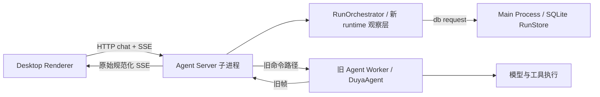

> Historical / superseded for execution. 原位置：`docs/architecture/12-monorepo-migration-phase-0-review.md`。
> 唯一执行入口：[587 主计划](../README.md)；设计冲突以 [00 合同](../00-contracts.md) 为准。旧 Status / checkbox / 行号保留为历史证据。

# Monorepo 与 Agent Harness：Phase 0 评审及迁移映射

日期：2026-10-03。范围：当前实现、MONOREPO_RFC、architecture 系列及相关执行计划。本文是评审交付物，不表示下述运行时修复已实施。

## 1. 判断

**保留 protocol / core / runtime 的方向，保留先在 Desktop 内实现 ControlPlane 的策略；调整按目录拆包的方案，并把执行正确性排在大规模搬文件之前。**

当前新三包适合作为迁移起点，但尚未接管旧 agent 的真实执行。新的 run 持久化、事件翻译和纯函数已有可用实现，不能据此推导预算、取消、恢复、审批或完整 headless harness 已完成。做最好的 harness，首先要能回答：哪个组件拥有执行？什么时候结果可信？进程被杀以后哪些动作可以重做？这些问题比包数量重要。

建议用六条约束统一后续设计：

1. 一个 run 只有一个权威执行入口和一个权威终态写入者。
2. protocol 不依赖业务实现；core 的算法通过显式输入工作；runtime 负责异步执行和端口协调。
3. ControlPlane 拥有跨 run 的持久化决策；worker 中的进程句柄、AbortController 和流不进入数据库。
4. Electron 是一种 host。包边界与进程边界分别设计，不能直接画等号。
5. 先通过真实旧执行器验证新契约，再逐步替换内部实现；允许有期限的兼容适配器。
6. 每一步交付可观测的行为改善或可验证的依赖切断，不能只交付新目录。

## 2. 证据与验证范围

工作期间共享仓库继续前进。最后核对 HEAD 为 `b5dd32ba`；主要运行时分析及下列探针对应当前未改动的 reference-run 源码。`07b13872` 已修复清洁检出时 protocol/core 产物构建顺序及 clean 删除 tsbuildinfo 的问题。

| 项目 | 本次证据 | 能说明什么 |
| --- | --- | --- |
| Electron 移入 `apps/desktop` | 当前目录、脚本与引用 | M1 的物理迁移已经落地 |
| 旧 agent | 生产 TS/TSX 口径：673 文件、158,850 行、36 个顶层模块 | 不能与含测试/生成产物的历史统计直接比较 |
| 新三包接入旧 agent | `packages/agent/src` 无新三包 import | 尚未完成旧执行内核分解 |
| import 审计 | 3,143 文件、14,123 边；583 跨包边、25 deep import、162 escape | 存在跨 host / package 的实际边界债务 |
| `architecture:check` | 802 条均被 baseline 容忍，退出 0 | 没有新增违规；不表示存量架构健康 |
| `architecture:self-test` | 通过 | 当前审计自身的回归用例通过 |
| `typecheck:all` | 本机现有产物环境下通过 | 本次暖构建验证通过 |
| reference-run 相关测试 | 9 文件、142 测试通过 | 当前纯函数、翻译器、脚本执行器、SQLite 闭环通过 |
| 清洁 CI | run 37095446083：Ubuntu typecheck 通过；macOS typecheck 因 Node heap OOM 失败；其他任务被取消 | 清洁构建顺序修复已有一项远端证据，完整 CI 仍失败 |
| 完整测试 / Electron / 真实 provider | 本次未重跑完整套件、未启动真实 Electron provider smoke | 无新增端到端通过声明 |

执行计划索引中的“42–45 失败套件 / 109–111 失败测试”是其记录的基线范围，本文没有重新确认整个套件。计划 586 的 P6 仍需真实 Electron 和配置 provider 验证。

审计的 SCC 统计为整个 packages 范围的 16 个，并非全在 agent。扫描包含 type import，且相对路径图无法覆盖所有 package alias / 动态边；不能把它直接当作完整运行时循环图。

当前重要边：main → agent 145，main → renderer 53，preload → renderer 4，renderer → main 8，agent → main 16，agent → cli 4，agent → ai 80。新 runtime → protocol 14、runtime → core 1、core → protocol 12。这些计数是相同审计口径下的边数，不是独立文件数。

## 3. 当前已经实现到哪里

当前执行路径应按实际调用理解：



入口证据：`apps/desktop/src/main/agents/server/router.ts` 的 SSE openRun 与旧 worker dispatch；`apps/desktop/src/main/agents/server/index.ts` 的 run orchestrator composition；`apps/desktop/src/main/agents/server/run-orchestrator.ts` 的观察器和 DB 适配器；`packages/agent/src/agent/DuyaAgent.ts` 的真实执行循环。

新 runtime 当前主要观察 POST SSE 帧，翻译为协议事件并记录结果。旧 worker 仍通过独立路径执行；新的执行 channel 在生产适配中没有承担完整 dispatch/stop。这个过渡选择有价值：可以验证存储和投影而不改变用户聊天。但其能力应称为 **reference run / execution observer**，不能称为已经替换的 runtime。

已经有真实价值的部分：

- protocol 的 manifest、envelope、结果和 capability 形状。
- core 的计数与终态决策纯函数。
- runtime 的翻译器、投影器、RunSession、控制接口雏形。
- SQLite `runs` / `run_events` 与终态 CAS。
- 新观察层失败时不阻断旧聊天的过渡策略。

还没有形成闭环的部分：manifest 对真实 worker 配置的权威控制、真实取消、持久化确认、预算执行、审批回传、恢复和工具副作用恢复。`resume` 抛错且 capability 关闭，是诚实的未实现；应继续保持这一点。

## 4. 四个已验证接缝，应优先于搬目录

本次用当前源码经 esbuild 打包执行隔离探针，不调用真实模型，不写产品数据库。位置为忽略目录 `.tmp-validation/monorepo-review-2026-10-03/`，以下输出可以作为新增测试的输入；探针本身不是生产修复。

| 探针 | 实际结果 | 后续应保证 |
| --- | --- | --- |
| manifest `maxTurns=1`，执行器产生 2 turn | `spentTurns=2, stopped=0, completed` | manifest 预算传入 session；执行期间超限触发停止并生成对应终态 |
| 执行器未结束时调用 `handle.result()` | 提前 `failed/runtime_crash`；执行器未停止；无终态事件写入 | result 等待已结束且满足持久化契约的结果，不能主动终止状态机 |
| append 被 gate 阻塞，然后 settle | 顺序为 `append-start → complete`，append 尚未完成 | 串行写入队列；complete 必须等待此前所有必要事件确认 |
| 存储返回 `{ok:false}` | run 仍被认为 completed | adapter 检查失败确认及 CAS 未应用，传播明确错误/降级状态 |

源码定位：

- `packages/agent-runtime/src/controller.ts` 的 `start` 创建 RunSession 时未传 `manifest.budget`。
- `packages/agent-runtime/src/run-session.ts` 的 `result` 在无终态时调用 `settle`；`flush` 先清空 buffer 后 await，没有保存此前 in-flight Promise；`settle` 在 flush/complete 前解决 terminal Promise。
- `apps/desktop/src/main/agents/server/run-orchestrator.ts` 的持久化 adapter await dbRequest，但不检查 negative ack。ControlPlane 捕获错误并返回结果对象，因此 await 成功不等于写入成功。

其他源代码确认的约束缺口：

- 新 runId 在 server 生成，DuyaAgent 内仍另造 runId；应贯穿 worker 命令，或先明确映射，不能混作同一标识。
- manifest 有空 tools/bindings、未解析环境 hash、缺少完整审批策略和真实输入引用。它当前是部分配置记录，不能用于可靠复现。
- 生产 channel 的 stop 为 no-op。用户旧路径的取消与新 controller 的取消不能视为同一验证结果。
- stream 队列超限静默丢最旧事件。迁移为 headless 公共接口前须区分可合并 delta 与必须交付的 durable/terminal 事件，并返回 gap 或可恢复 cursor。
- runtime 的生产代码使用 `@duya/agent-protocol/testing` 的 RunLedger。应把生产状态机放进正常公开入口；testing 子路径保留 fixture 和断言助手。

失败时继续旧聊天可以作为过渡产品策略，但需要显式 `persistence degraded` 状态；不能让“聊天仍可用”变成“run 已可靠存档”。

## 5. 建议的责任边界

| 边界 | 应拥有 | 不应拥有 |
| --- | --- | --- |
| `agent-protocol` | 可序列化公共契约、schema/codec、版本、稳定 ID、capability、必要的规范化/hash | provider 客户端、数据库、进程句柄、业务模式实现、工具注册表 |
| `agent-core` | 状态 reducer、预算决策、权限策略求值、纯 prompt 渲染、压缩转换、上下文选择算法 | 模型调用、目录扫描、watcher、模板文件读取、sleep/retry IO、跨 run 持久化 |
| `agent-runtime` | run 生命周期、异步循环、模型/工具调用、IO 端口、事件顺序、取消与背压、上下文装配执行 | Electron API、Renderer、某个 SQLite schema、产品任务与定时调度的最终归属 |
| ControlPlane | Goal/Task/Run 持久化、调度、审批、lease/fence、checkpoint 索引、恢复与终态提交策略 | UI 组件、worker 内存句柄、模型循环、把所有进程逻辑塞进数据库 |
| host adapters | Electron IPC/HTTP composition、SQLite/文件/provider/进程适配器、平台沙箱实现 | 重复一套业务状态机 |
| Desktop UI | 展示、交互、投影状态、用户操作入口 | run 真相、直接导入 main 实现或带服务的后端 barrel |

“core 纯”需要具体定义。建议为 **输入中不藏执行能力、实现不自行访问外部世界**。一个文件没有 NET import 不代表纯：DuyaAgent 经 ai 包调用模型；加载模板与 chokidar watcher 同样是 IO。不能凭目录名或静态 IO 计数决定迁移。

runtime 是代码模块，不是一种进程。它可以运行于 worker，由 server 或 headless host 管理。ControlPlane 即使先放 `apps/desktop/src/main/control-plane`，其决策模块也应避免直接 import Electron；平台调用放 adapter。现在该路径的 factory 在 server 子进程被调用，源码路径没有自动赋予 main 的所有权。

建议保持最小物理结构：

```text
apps/
  desktop/
    src/main/
      control-plane/       # 初期 host 内的持久化决策与服务
      agents/server/       # HTTP/SSE composition + 兼容适配
      ipc/                 # Electron transport adapters
      db/                  # 现有 SQLite 实现，暂不另造 storage 包
    src/preload/           # 安全桥
    src/renderer/          # UI
    src/contracts/         # 暂时只有 Desktop 消费的 browser-safe DTO
  agent-server/            # 仅在真实第二种 host 需要时建立
packages/
  agent-protocol/
  agent-core/
  agent-runtime/
  agent/                   # 迁移期间兼容入口，逐步缩小
  ai/ plugin-core/ computer/ conductor/ gateway/ voice/ cli/
evals/
  agent/                   # harness 的消费者；可按需要设 private workspace
```

先不建立通用 tools/memory/storage/ui 包。确有两个独立消费者且公开边界稳定后再提取 shared；不要把 service、平台类型、DTO 一起扔进 shared。workspace 成员、是否发布、CI 是否执行是三个决定。给 evals 配置依赖不必使其进入生产打包或每次 CI。

## 6. 旧 packages/agent：按职责拆，不按原目录搬

以下覆盖当前 36 个顶层模块。每组迁移应先识别公共契约、纯逻辑、IO 协调和具体 host 四层；表中的拆分是目标，非批量 mv 指令。

| 当前模块 | 目标与拆分 | 删除旧位置前的验收 |
| --- | --- | --- |
| `agent`, `process`, `abort`, `queue`, `lifecycle` | 真实异步循环/取消/队列归 runtime；纯 outcome/状态归 core；process bootstrap 与 MessagePort 归 host adapter | 新入口真正控制旧 worker dispatch/stop，模型和工具结果一致 |
| `tool` | wire 调用/结果归 protocol；纯参数/策略归 core；pipeline、registry、subagent runner 归 runtime；FS/Bash/MCP 实现按执行 adapter 保留 | 注册/快照/权限/流式工具真实调用；不暴露整个 registry 给 protocol |
| `modes`, `decisions` | reducer/声明归 core；运行期 hooks/tools 归 runtime；Goal/Research 等跨 run 数据与恢复决策归 CP；UI 配置归产品 | mode 生命周期、continuation、持久化快照及恢复用例通过 |
| `prompts`, `context`, `agentsmd`, `mentions` | 纯排序/截断/渲染归 core；模板读取、目录扫描、watcher、引用解析 IO 归 runtime adapter | 同输入输出 fixture；实际 prompt/context 来源有 provenance |
| `compact`, `message` | 纯转换归 core；确为公共 wire 的 schema 归 protocol；模型压缩调用与 transcript IO 归 runtime | token/压缩质量与 transcript 完整性；不能只看 compact 的零 IO 计数 |
| `session`, `journal`, `memory-rollout` | durable transcript、checkpoint、日志仓储由 CP/host 提供；runtime 通过端口使用；会话投影归 UI | session 多 run、重启读回、终态与事件一致 |
| `memory-state` | Goal/Task/Run durable 模型归 CP；SQLite migration/repository 先留 host；共享纯 schema 可 protocol | 去除 agent → main migration import；兼容现有数据库及 reader |
| `permissions`, `security`, `sandbox` | wire request/decision归 protocol；纯判定归 core；realpath/环境/沙箱执行归 runtime/host；人工批准归 CP | 请求到审批到执行闭环，revocation 与 TOCTOU 测试 |
| `skills`, `mcp`, `config`, `providers` | 配置引用/schema 可 protocol；发现/加载/连接/provider IO 归 runtime adapter；产品安装/OAuth配置归 host | connector conformance、重连与快照更新，不携带 secrets 入 manifest |
| `hooks`, `agent-profile` | 纯声明/组合归 core；hook executor 归 runtime；平台 hook adapter 归 host | 实际 hook 顺序、失败策略和 async 取消行为保持 |
| `wake`, `channels` | 跨 run trigger/调度及外部 channel 管理归 CP/host；run 内输入 mailbox 归 runtime；payload归 protocol | 自动化/队列/活跃 run 的投递与重复触发测试 |
| `cli` | CLI 解析/UI/启动归 cli host；旧 agent 暂存兼容 adapter；被 agent 引用的纯 command DTO 提取 | agent 不依赖 CLI 的 runner/服务入口；CLI 真正运行新边界 |
| `ipc` | wire message归 protocol；MessagePort transport/bootstrap归 runtime host adapter | 三通道与真实 worker handshake 验证 |
| `observability` | 事件公共形状可 protocol；runtime 通过 telemetry port 发出；logger 后端归 host | 不 import Desktop logger，保证脱敏和 trace/run 关联 |
| `utils`, `types`, `constants`, `modules` | 逐项按消费域归属；不用新 utils/shared 兜底；空模块目录可最后清理 | 每个导出有真实消费者，无跨层 barrel 回流 |

具体例子：TurnStreamRunner 会调用 provider、retry/sleep/logger，是 runtime；纯 token 统计是 core。SessionFinalizer 混合 hook 和工具协调，需拆函数后移动。旧 `AgentRuntime.ts` 是内部 getter 接口，不等于新三包的 runtime API。CLI contract barrel 还导出 runner 构造函数，不能整份搬成 protocol。

现在最有价值的切边是 agent → main（migration/automation 类型等），以及工具/skills/permissions 的混合依赖。42 成员 SCC 与 14 成员 SCC 是不同集合；只改后一集合内部边，不保证前者缩小。先列出 value-import 循环与可切断边，再承诺每个 PR 的变化。conductor 的 React 循环和其他包的 type-only 循环不应一律成为第一条 run 接通的前置条件。

## 7. Electron：迁移实现责任，保留 host 责任

| Desktop main 当前区域 | 建议处理 |
| --- | --- |
| `agents` | server/router、worker pool、进程启动保留 transport/composition 责任；实际 run 引擎移 runtime；消除 server 与 controller 双重 dispatch |
| `control-plane`, `automation`, `wake` | 持久化决策收束到 CP 服务；cron/工作流/wake 是不同触发来源，通过统一任务/run入口协调；不要按名字重复删除 |
| `db`, `memory`, `memory-state`, `project-database` | SQLite/文件 adapter 暂留；剥离纯业务对象及 repository port；去除 agent 对 host migration 的反向引用 |
| `ipc`, `core`, `gateway`, `messaging`, `channels` | Electron IPC/窗口/生命周期属于 host；Gateway 和外部渠道 adapter 保留；业务请求委托 CP/runtime |
| `config`, `plugins`, `skills`, `services`, `import` | 区分产品安装/账户/导入服务与执行时加载；前者 host，后者 runtime adapter；复用已存在包 |
| `cli`, `conductor` | host 入口/平台代理保留；可复用引擎用现有包。不要引入 Desktop 依赖到 conductor |
| `logging`, `lib`, `types`, `utils` | 逐项审计，browser-safe DTO 移 contracts；logger 实现保留，runtime用port；不按文件夹整体共享 |
| `preload`, `renderer` | 保持 Electron 安全桥和 UI；共享契约单向 import；backend 不再从 renderer 获取类型/实现 |

优先修复 main → renderer 53 边及 preload → renderer 4 边，把 DTO/type 与组件和服务分开。renderer → main 的 8 边同样需要判断 type/value；仅改 import 为 `import type` 不会自动让平台形状适合浏览器。

Node 中按 package name 导入时，`exports` 在支持它的版本中优先于 `main`。因此不能用“main 指向 src 导致 exports 不起作用”解释边界泄漏。相对路径越界、tsconfig alias 与构建 resolver 的绕行才应逐条排查。[Node package 文档](https://nodejs.org/api/packages.html)

## 8. 原规划中需要统一的设计决定

### Core 与 Mode

03-target-structure 将 agent/modes/prompts/context 大块归 core，但这些目录中有 provider 调用、FS、watcher、hook IO；新 core 描述为 zero IO。应以第 5 节定义统一。Goal 等 mode 的纯状态转换、run 内动作、跨 run 存储分别归 core/runtime/CP，不能只选“全部 core”或“全部 CP”。

### Workspace、Session 与 Channel

RFC 同时要求 workspaceId 又说无需持久化 identity/table，当前 session 衍生短 hash 只是过渡命名。需要先决定：workspace 是每次解析出的 snapshot，还是能关联历史 run 的 durable entity。前者不应伪装稳定身份；后者必须有碰撞、重命名、Root 迁移策略。immutable manifest 也不能冻结 realpath、权限撤销或外部状态。

Session 不能直接降为外部 Channel。保留 durable conversation/session 与消息历史；Channel 负责外部地址/入口；Goal、Task、Run 有独立关联。一段会话可产生多 run，一个 Goal 可跨 session。旧三种 Task 分别是持久 TODO、活跃子 agent 句柄与后台 Bash 进程记录，需关联和命名澄清，不能合成同一张表。

### Snapshot、Checkpoint 与 Replay

manifest hash 证明记录的配置一致，不证明外部世界一致。需要输入/附件/content引用、provider与工具版本、上下文来源、审批策略版本；secrets 仅存引用。动态变化要记录每轮 provenance，而非假设一次性 snapshot 覆盖一切。

run_events 只保存 durable 子集，seq 可以有间隔。合同应写“全事件序列单调，持久子集稀疏”，不能许诺 gapless。旧 checkpoint enqueue 缺少生产入口；新增 runs 表不等于 crash-resume。

工具副作用恢复至少需要：执行意图 → attempt/fence/idempotency key → 结果确认 → checkpoint 提交。杀进程发生在外部成功、本地未确认之间时，应标记 outcome unknown 并 reconciliation。任意第三方 API 都 exactly-once 的承诺不成立；按工具能力定义重试安全等级。

### Evals 与迁移顺序

evals 是 harness 的消费者，用来衡量行为，不替代生产控制层。应在大规模迁移前接入旧真实 worker：offline mock provider 验证取消、工具、审批、mailbox、context、恢复协议；少量固定配置 live-provider smoke 验证 transport。模型实测通常不能要求逐 token 完全确定。

Anthropic 对长任务 harness 的实践也强调可读进度、增量工作与端到端验证，目录拆分本身不会提供这些能力。[长任务 harness 实践](https://www.anthropic.com/engineering/effective-harnesses-for-long-running-agents)

### 构建、循环与治理

当前 CI 已触发 master；旧文档“不曾 push CI”的结论应更新。当前有 active ruleset 防删除及 non-fast-forward，但没有 required status checks。architecture gate 尚未进入 workflow，baseline 通过与 CI 通过不是一回事。最后核对的 [CI run 37095446083](https://github.com/lava-chen/duya/actions/runs/37095446083) 在 macOS typecheck 出现 Node heap OOM，完整流水线失败；需独立解决类型检查内存问题并完成跨平台复核。

clean build 次序已在 `07b13872` 修复。后续可以显式 project references 与 `tsc -b`，或保持可靠的 topological scripts；不要同时保留两套不一致顺序。TypeScript references 使用依赖的声明产物，普通单项目检查不自动构建依赖。[TypeScript project references](https://www.typescriptlang.org/docs/handbook/project-references.html)

当前 root agent build 串行命令已没有旧 conductor 两遍 build hack，不应继续把清理该 hack 列为最高优先事项。550 的 runner 状态及相关索引也需要以源码核对；共享仓库最新提交已更正部分索引。

resolver 或审计算法变化后重写 baseline，需要展示分类变化与新旧违规 diff，避免把新增边一起容忍。type graph、runtime value graph、package build DAG 应分开记录。减少 SCC 是有用指标，但不能取代边方向、公开接口和执行验证。

schema 迁移不是 git revert 就能回滚。采取 additive expand/contract、旧 reader 兼容窗口、迁移备份和清晰降级；外部工具副作用另需补偿或人工确认。

## 9. 分阶段路线与第一批 PR

### Phase 0：收敛规格与当前真相

- [ ] 将 core IO 定义、mode 三层归属、CP owner、Session/Channel/Workspace identity 写成可引用决定。
- [ ] 计划 586 明示 observer 能力及未实现能力；以四个探针补齐失败验收。
- [ ] 更新旧 CI/构建/SCC/runner 事实；保留 warm / clean / unit / Electron 的证据区别。
- [ ] 给 boundary audit 增加 type/value 与 host 分类；选择第一条真实 run 接入切边。

### Phase 1：让一个 Run 真正拥有执行

建议拆成两个可独立评审的 PR，保持旧聊天 fallback：

**PR A：结果与持久化正确性。** result 等待、串行 append、终态 durable barrier、negative ack/CAS 检查；保证重复 settle 使用同一完成 Promise。故障注入包括慢写、失败 ack、终态并发、写入崩溃，不能只用立即 resolve 的 mock。

**PR B：执行控制闭环。** manifest 与 canonical runId 传入旧 worker；输入引用真实；controller/adapter 承担 dispatch/stop/permission；移除双入口；预算运行中执行；验证 cancel 与 done 同时发生的策略、grace period 后升级终止，以及关闭连接和继续后台运行的明确产品规则。

在接入前继续声明参考能力，不开放 resume/pause 等 unsupported capability。处理同 runId 重复 start 为幂等复用或明确拒绝，不覆盖活跃 map。终态重复事件应可辨别相同重试和内容冲突。

### Phase 2：建立迁移前的行为基准

- [ ] 将新 runtime adapter 接到真实旧 worker + offline provider，验证工具注册、hooks、mode、审批、消息中途追加、subagent、错误和取消。
- [ ] 真实 SQLite + worker 杀进程故障注入；输出标准 run artifact。
- [ ] 补齐真实 Electron / provider P6 smoke。
- [ ] 引入 evals 消费接口；固定输入与版本，比较完成率、取消延迟、恢复成功率、重复副作用率、token/cost 和性能。

### Phase 3：逐步提取旧代码

先解决 agent → main 和 CLI barrel，再提取纯 message/compact/prompt transforms、权限 reducer；随后迁移 TurnStreamRunner、工具执行、context loaders、hook executors。每个切片遵循：

1. 在旧位置提取可独立测试的契约/函数，先不移动大量文件。
2. 替换反向依赖为端口；提供现有实现 adapter。
3. 移到目标包公开入口；兼容旧导出，禁止新增旧路径消费者。
4. 使用 Phase 2 基准验证真实调用，检查 package/build/value graph。
5. 迁移所有消费者，删除旧 shim；同一提交更新计划。

不要求先清掉所有 16 SCC 才进行这一步。对每个 shim 记录消费者数、负责人和退出验收，避免旧 agent 永远作为万能 barrel。

### Phase 4：恢复与长期目标

CP 接入 lease/fence、checkpoint、审批重启、Goal/Task 与 Run 关联。先支持可安全恢复的工具，再扩展未知副作用 reconciliation；恢复包含模型状态、上下文、输入 mailbox 与产物索引，不能仅恢复状态枚举。

### Phase 5：第二 host 与旧包退役

当同一 runtime 可由 CLI/headless composition 使用，并且 CP/SQLite adapters 不依赖 Electron 时，再决定提取 CP 包或建立 apps/agent-server。删除旧 agent 的职责以后才删除包名。不要为了目标图提前创建一堆空包。

## 10. Harness 的完成标准

| 能力 | 可观测验收 |
| --- | --- |
| 执行权威性 | UI、CLI、automation 使用同一 run contract；runId贯穿，没有双 dispatch |
| 结果可信 | result 不提前结算；终态与 durable 事件确认一致；失败 ack可观测 |
| 可控执行 | 预算运行期执行；取消延迟有上限；并发/队列/backpressure 有明确策略 |
| 可恢复 | kill worker/server/main 后能解释并继续安全 run；未知副作用不盲目重放 |
| 权限与隔离 | 审批审计可读回；revocation有效；root实际访问与sandbox隔离验证 |
| 上下文 | 来源、版本、选择/截断原因可追溯；动态输入与附件身份保留 |
| 插件与工具 | 目录快照与真实调用一致；连接降级和重连通过 conformance |
| 长期工作 | Goal/Task进度和产物有完成证据；多session可关联；失败后可继续 |
| 质量与维护 | 新 host无需import Electron；clean build与required checks；回归eval有失败归因 |

第一阶段完成后，最直接的成果应是：**同一个旧 agent，通过新的 run 边界启动，预算与取消有效，事件可靠落盘，读取结果不会改变执行，真实 Electron 闭环有证据。** 此后目录迁移才有稳定锚点。

## 11. 复核入口

主要设计：`MONOREPO_RFC.md`、`docs/architecture/03-target-structure.md`、`04-agent-harness-design.md`、`06-migration-plan.md`、`11-protocol-forward-review.md`，以及 exec-plan 索引中 550/583/584/585/586 的当前路径。

主要源码：`packages/agent-runtime/src/{controller,run-session}.ts`、`apps/desktop/src/main/agents/server/{run-orchestrator,router,index}.ts`、`apps/desktop/src/main/control-plane/{manifest-factory,run-control-plane}.ts`、`apps/desktop/src/main/db/core/run-store.ts`、`packages/agent/src/agent/{DuyaAgent,TurnStreamRunner}.ts`。

本次定向验证命令：

```powershell
npm run architecture:check
npm run architecture:self-test
npm run typecheck:all
npm test -- packages/agent-runtime/test packages/agent-core/test apps/desktop/src/main/__tests__/reference-run-closed-loop.test.ts apps/desktop/src/main/__tests__/reference-run-control-plane.test.ts apps/desktop/src/main/__tests__/run-orchestrator.test.ts apps/desktop/src/main/db/core/__tests__/run-store-migration.test.ts
```

这些命令的通过范围见第 2 节。评审未改运行时代码，未提交或推送。
