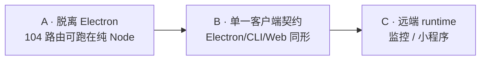

# 601 — Headless Control Plane

> **把控制平面从 Electron main 里摘出来,变成一个纯 Node 进程。**
> Electron、CLI、Web、小程序全部降级为它的**客户端**;agent runtime 可以跑在
> 本机,也可以注册到远端电脑上。

## 0. 本文件的事实基线

**所有 `path:line` 引用都在 `origin/master @ 46c36d9d` 上实测过。**

这不是形式声明。写这份计划时本地 `master` 落后 30 个 commit(`135901bf`),
S0 门禁代码尚未落地,差点让"门禁不存在"这个结论写进计划。**任何引用未跟踪
工作树的分析在合入前必须重测。**

实测日期 2026-10-05。核心 13 条见 [§3](#3-今天的耦合实测) 与
[00-contracts.md §0](00-contracts.md#0-实测基线)。

---

## 1. 执行 agent 从这里开始

1. 读仓库 `AGENTS.md`、`ARCHITECTURE.md`。
2. 读本文件 → 读 [00 合同](00-contracts.md)(角色与边界,**唯一权威**)。
3. 读你负责的阶段文件,按其"唯一 next action"开工。
4. 阶段门禁合入前**必须做变异证明**(见 [§7](#7-门禁每条都要能变红))。
5. 每轮开工前在 [90 执行日志](90-execution-log.md) 追加实测数字,**带 scope**。

---

## 2. 决策(2026-10-05)

> **Electron main 不再是控制平面。**

今天 Electron main **就是**控制平面:它持有数据库、内嵌 104 条路由的
HTTP API、并把 Agent Server 作为子进程拉起来(子进程只能靠 `process.send`
回问父进程要数据库)。这个焊接是"没有 web 端"的**唯一根因** —— 不是因为
没人写前端,是因为控制平面需要 `app.getPath('userData')`。

因此本系列做**一次倒置**:

| | 今天 | 之后 |
| --- | --- | --- |
| 控制平面 | Electron main 进程 | 独立纯 Node 进程,可独立部署 |
| Electron | = 控制平面 + UI | 控制平面的**客户端** + 本机 runtime 宿主 |
| CLI | localhost HTTP 客户端 | 同一个客户端契约 |
| Web | 不存在 | 同一个客户端契约 |
| 小程序 | 不存在 | 同一个客户端契约(裁剪版) |
| 远端电脑 | 不存在 | runtime 注册到控制平面,可被监控 |

**推翻 600 的 `apps/web/` 不建裁决。** 600 `README.md:128` 写的是
"`apps/web/` 本系列不建,纯 Electron 应用。要么从目标树划掉,要么单独立项。"
**本系列就是那个"单独立项"**,该句作废。

实测依据:该裁决**没有任何机器强制** —— `apps/web` 在
`architecture-policy.yaml` 的所有 declared root 之外,而
`architecture-check.mjs:186-187` 对未分类目标**默认放行**。所以推翻它是免费的,
不需要先改任何门禁。

> **600 侧已于同日同步(PR #215)。** 600 的 `README.md:128` 改写、`apps/server/` 补进目标树,
> 600 合同抬头加了管辖表与双向不越界声明。**本文件与 600 `00-contracts.md` 现按管辖范围切开:
> 600 管层与依赖方向,本系列管进程与网络边界** —— 详见 [00-contracts.md](00-contracts.md) 抬头。

---

## 3. 今天的耦合(实测)

在 `46c36d9d` 上逐项测得。**这是本系列存在的全部理由。**

### 3.1 硬阻塞:6 个 handler 在模块加载期就需要 Electron

```
apps/desktop/src/main/cli/handlers/backup.ts:17    import { app } from 'electron';
apps/desktop/src/main/cli/handlers/extra.ts:24     import { app } from 'electron';
apps/desktop/src/main/cli/handlers/extra2.ts:23    import { app } from 'electron';
apps/desktop/src/main/cli/handlers/security.ts:19  import { app } from 'electron';
apps/desktop/src/main/cli/handlers/status.ts:18    import { app } from 'electron';
apps/desktop/src/main/cli/handlers/update.ts:20    import { app } from 'electron';
```

这 6 个被 `cli-api-server.ts:24-131` 的 handler 导入图**静态引入**。
**纯 Node 进程连 `require` 这个模块图都会失败** —— 不是"请求时出错",
是"加载不起来"。这是本系列唯一的 Phase A 阻塞。

### 3.2 好消息:同一目录里已有正确写法

另外 6 个 handler **早就是** headless 安全的:

```
handlers/config.ts:92      const { app } = require('electron');   // 包在 try/catch
handlers/crons.ts:140      handlers/gateway.ts:58
handlers/mcps.ts:92        handlers/plugins.ts:174
handlers/skillWrite.ts:33
```

外加环境变量覆盖 `DUYA_CLI_USER_DATA_DIR`(`handlers/plugins.ts:170`)。

> **Phase A 不是设计新东西,是把 6 个改成仓库里已经存在的 6 个的写法。**
> 这一点决定了 Phase A 的风险等级 —— 见 [01](01-headless-control-plane.md)。

### 3.3 数据库路径同样焊在 Electron 上

```
apps/desktop/src/main/config/boot-config.ts:15   import { app } from 'electron';
apps/desktop/src/main/config/boot-config.ts:31   path.join(app.getPath('userData'), 'databases')
apps/desktop/src/main/config/boot-config.ts:51-52  legacy 迁移同样依赖
```

> **顺带纠正一个过期前提:`boot.json` 已经不存在了。**
> `boot-config.ts:5` 写着 "boot.json is gone (plan 334, decision 6)",
> 真相是 `~/.duya/config.toml` 的 `[storage].database_path`。
> 任何还按 `boot.json` 讨论数据库路径的文档都是错的。

### 3.4 Agent Server 只能通过父进程拿数据库

```
apps/desktop/src/main/agents/server/index.ts:190-191  process.send({ type: 'db:request', ... })
apps/desktop/src/main/agents/server/index.ts:195      reject(new Error('process.send not available — not running as child_process'))
```

`:195` 写得很清楚:**不是子进程就直接拒绝**。所以控制平面一旦独立,
Agent Server 必须换一条 DB 通道。这是 Phase A 的结构性部分。

### 3.5 已经 headless 的部分(好消息,不要重做)

| 范围 | 实测 |
| --- | --- |
| `apps/desktop/src/main/agents/server/**`(24 个 `.ts`) | **零**真实 electron import。`router.ts:112` 与 `:160` 是**两条禁令注释**,不是 import |
| `packages/agent-runtime/src/**` | **零** electron import |
| `packages/agent/src/cli/**` | headless 入口 `runHeadlessMode` 今天就能跑 |
| `packages/agent-runtime/src/transport/http-sse-transport.ts:183` | 已是一个**自带 bearer(`:211-215`)+ origin allowlist(`:219`)** 的独立 HTTP+SSE 服务器 |
| `apps/desktop/src/contracts/` | 3 个文件,`git.ts` / `import.ts` **零 import**,`contracts-boundary.test.ts:59,:84,:102-129` 三方强制 |

**结论:agent 循环和传输层已经 100% headless-capable。本系列不碰它们。**

### 3.6 现有控制面已经是个像样的 HTTP API

```
apps/desktop/src/main/cli/cli-api-server.ts   979 行 / 104 条路由分支(全部 /v1/*)
  :158   checkBearer(...)                    ← 路由前强制鉴权
  :931   server!.listen(0, '127.0.0.1', ...) ← 随机端口,仅本机
  :9     userData/runtime/cli-api.json       ← {port, token, pid} 原子落盘
```

**104 条路由 + bearer 鉴权 + 运行时发现文件 —— 一个 headless 控制平面
需要的骨架已经齐了,只差 §3.1/§3.3 那两个 Electron 硬依赖。**
这就是为什么 Phase A 值得先做:它把 90% 已有的东西变成可部署的。

---

## 4. 目标拓扑

```text
                    ┌────────────────────────────────────┐
   小程序 ────────▶ │                                    │
   apps/web  ────▶ │   Control Plane (纯 Node, 可部署)    │ ◀──── CLI (@duya/cli)
   Electron   ────▶ │   · 身份 / Session / Project        │
   (客户端)         │   · Goals / Tasks / Runs 记录       │
                    │   · 调度 / 审批 / 唤醒              │
                    │   · 客户端 API (browser-safe DTO)   │
                    │   · 认证与授权                      │
                    └───┬──────────────────────────┬─────┘
                        │ 注册 + 心跳              │ 本机直连
                        ▼                          ▼
            ┌───────────────────────┐   ┌──────────────────────┐
            │ 远端 computer runtime │   │ 本机 runtime          │
            │ (被监控的电脑)         │   │ (Electron 宿主 / CLI) │
            │ · 工作区 / 工具 / 凭据 │   │ · 同一 runtime 接口   │
            └───────────────────────┘   └──────────────────────┘
```

**关键:控制平面不执行 run、不碰工作区、不持有工具凭据。**
它只拥有记录与调度。这条边界直接来自 600 的 CP / Runtime 分层 ——
601 不发明分层,只给它**进程边界和网络边界**。

---

## 5. 三个角色,不是三个模块

完整定义见 [00-contracts.md §1](00-contracts.md#1-三个角色)。此处只记判据:

| 角色 | 判据 | 数量 |
| --- | --- | --- |
| **Client** | 只读记录 + 发指令,**不执行 run、不碰工作区** | 多个,可互换,互不信任 |
| **Runtime** | 执行 run、持有工作区与工具凭据 | 每个注册节点恰好一个 |
| **Control Plane** | 拥有身份与记录、调度、对外 API | 全局恰好一个(或一个集群) |

**"Electron 和 CLI 共享后台逻辑"的实现方式就是这个划分本身** ——
共享的是 Control Plane,不是 Electron main。今天它们"共享"的方式是
CLI 去连 Electron 里的 localhost 端口,那叫共享宿主,不叫共享逻辑。

---

## 6. 阶段与唯一 next action



| 阶段 | 文件 | 前置 | 唯一 next action |
| --- | --- | --- | --- |
| **A** 脱离 Electron | [01](01-headless-control-plane.md) | 无 | 让 6 个 handler + `boot-config.ts` 采用仓库已有的软 require 写法,并给 Agent Server 一条非 Electron 的 DB 通道 |
| **B** 单一客户端契约 | [02](02-client-unification.md) | A | 把 renderer 的 IPC 形状与 CLI 的 HTTP 形状收敛到 `contracts/` 的 browser-safe DTO 上 |
| **C** 远端 runtime | [03](03-remote-runtime.md) | B | runtime 注册 + 心跳 + 远端流式,非浏览器客户端 |

### 6.1 为什么 A 不必等 600

600(分层重构)正在 S1a/S2 途中。**A 与 600 无文件所有权冲突**:
A 只碰 handler 函数体与 `boot-config.ts`,而 600 的切片动的是
agent 循环、Session schema、RunEngine 端口。

> **A 与 600 可以并行。** 这是本系列先做 A 的唯一理由 ——
> 它不是"更重要",是"不挡路"。

B 和 C **必须等 600 的 CP 成为真实分层**:在 RunEngine 落地之前统一契约,
等于把两个还没稳定的形状焊死。

### 6.2 放置位置(受策略约束,不是随手选的)

`architecture-policy.yaml:162-169`:

```yaml
- from: packages/**
  to: [electron/**, src/**, apps/desktop/**]
  reason: workspace packages must not depend back on the host
```

**所以控制平面不能进 `packages/`** —— 它必须触达
`apps/desktop/src/main/cli/handlers/**`,而那条规则禁止这条边。
因此:

- `apps/server/` — 控制平面(**app**,因为它没有包外消费者)
- `apps/web/` — 浏览器客户端
- 二者都**不撞任何门禁**(未分类 root 默认放行,`architecture-check.mjs:186-187`)

判据与 600 `00-contracts.md:61-65` 一致:**有包外消费者才进 `packages/`。**
控制平面是 app,不是包。

---

## 7. 门禁:每条都要能变红

> 600 的纪律,本系列继承:守卫报告事实却不检查任何东西,比红测试更危险。
> 每条门禁合入前**变异证明**:制造它要防的那种回归,确认变红;完全回退,确认树干净。

| 门禁 | 检查什么 | 变异证明 | 状态 |
| --- | --- | --- | --- |
| **A1** 控制面可脱离 Electron 加载 | 在 `require('electron')` 会抛的进程里加载完整 handler 图 | 加回一个 `import { app }` | 待做(Phase A) |
| **A2** 数据库路径不需 Electron | 无 Electron 时能解析出 DB 绝对路径 | 删掉 `~/.duya` 兜底分支 | 待做(Phase A) |
| **A3** runtime 通道非父进程 | Agent Server 在无父进程时能拿到 DB | 断开新通道,确认回落 `process.send` | 待做(Phase A) |
| **B1** 契约 browser-safe | 客户端契约零 electron / node 内建 / DOM 类型 | 在契约里加一个 `Buffer` | 待做(Phase B) |
| **B2** 客户端形状唯一 | 同一能力不存在 IPC 与 HTTP 两套 DTO | 保留一处 IPC 专用形状 | 待做(Phase B) |
| **C1** runtime 注册有身份 | 每个注册 runtime 有唯一可撤销身份 | 复制一个 runtime id | 待做(Phase C) |
| **C2** 越权被拒 | 客户端 A 不能读 runtime B 的工作区 | 用 A 的 token 请求 B 的资源 | 待做(Phase C) |

**A1 是本系列最关键的一条**,因为它精确对应今天真实存在的缺陷,
且现在就是红的。

### 7.1 门禁数字必须带 scope

引用任何测试数字时格式是 `<通过>/<总数> in <scope>`。裸数字不接受 ——
脱离 scope 的数字不可判读,读者无法知道该跑什么才算达标。

---

## 8. 与 600 的关系(以及一个必须先说的缺口)

### 8.1 600 取代 587;601 追加在 600 之后

600 仍负责分层(Host → CP → Runtime → Core → Protocol)。
**601 不重做分层**,只回答 600 没回答的两个问题:

1. 控制平面**跑在哪个进程**?(600:没回答,默认在 Electron main)
2. **谁可以当它的客户端**?(600:默认只有 Electron renderer)

### 8.2 缺口:600 的计划文档不在任何分支上

实测:`origin/master @ 46c36d9d` 的 `docs/exec-plans/active/` **只有 587**,
`docs/exec-plans/README.md` **完全没提 600**。

- 600 的**代码**(S0 门禁,PR #209 → `46c36d9d`)**已合并**
- 600 的**11 份计划文档**只存在于本地共享检出,未跟踪

**因此本文件不引用 600 的文档作为前提**,只引用它的**已合并代码**与
共享的架构判据。601 自带全部前提。

> 600 文档未跟踪这件事**超出本系列范围**,但它真实存在:
> 按 `docs/exec-plans/README.md:41` "A plan becomes tracked when it is written",
> 600 目前违反了自己的规则。已记入 [90 执行日志](90-execution-log.md#未决)。

---

## 9. 完成定义

> 按 600 的教训重写:**"文件搬走了"不是落实,"同一个能力只有一个 live owner
> 且被真实消费者调用过"才是。**

本系列完成 = 同时满足:

1. **A**:`duya serve` 在**没有 Electron、没有桌面环境**的机器上启动,
   104 条路由可从远端调用,DB 指向显式配置路径。
2. **B**:Electron renderer 与 CLI **调用同一份契约**;
   能力 N 不存在"IPC 一套形状、HTTP 另一套形状"。
3. **C**:一个远端 computer runtime 能注册、被认证、被监控;
   小程序客户端能读到它允许读的那部分。
4. **一条能力,一个 live owner** —— 每一项都有**真实消费者**的证据,
   不是"新路径已就位"。

**不算完成的**:文件已创建、包已建立、契约已定义、门禁全绿而无变异证明。

---

## 10. 支持资料

| 文件 | 内容 |
| --- | --- |
| [00 合同](00-contracts.md) | 三角色定义、边界、依赖方向。**唯一权威** |
| [01 脱离 Electron](01-headless-control-plane.md) | Phase A:104 路由的最小改造 |
| [02 单一客户端契约](02-client-unification.md) | Phase B:契约收敛 |
| [03 远端 runtime](03-remote-runtime.md) | Phase C:注册、监控、小程序 |
| [90 执行日志](90-execution-log.md) | 每轮实测数字与未决问题 |

外部参考:`E:\cloned-projects\ZCode` 的 `zcode --web` 模式
(`packages/server/src/http.ts:399-416` 单端口同时托管 API / WebSocket /
静态资源 + SPA 回退)。**可抄单端口托管;不必抄它的 WebSocket 二进制协议** ——
详见 [03 §4](03-remote-runtime.md#4-zcode-抄什么不抄什么)。
