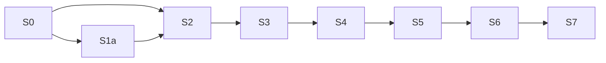

# 600 — 分层架构落地:Host → Control Plane → Runtime → Core → Protocol

> Status: Active — **S0 已完成并合并进 `origin/master`(`46c36d9d`)。S1a 实质完成(仅剩归 S6 的 G6)。S2 底座已合并,剩 b5 切换。**
> Created: 2026-10-04. Priority: P0. **唯一执行队列:本文件。**
> Current task: **S2 · b5 真实切换** —— 把 GUI 路径从 `DuyaAgent.streamChat` 切到 RunEngine,目标 `G8: 1 → 0`。
>
> **2026-10-05 21:45 实测基线(`origin/master` @ `0967b2ee`):门禁 0 new / 0 stale**,
> `G1=0 G3=0 G4=2 G6=9 G7=0 G8=1 G9=6`。**这组数字与 PR #213 之前逐项相同** ——
> `c10dc64c` 改了 type-only import 的边判定、`8f4db8e1` 重录了 baseline,两者净效果为零。
> `packages/agent-runtime/test` **631/632** —— **该数字实测于 `944ab71c`,尚未在 `0967b2ee` 上重测**,
> 唯一红是 `coalescing-throughput` 的墙钟断言。引用它时必须带这个 scope。
>
> **S2 全线已合并(PR #213,`0967b2ee`)。** 此处曾长期写着"32 个未合并 commit",已作废。
> **⚠️ 本目录此前从未进过 git**(`git ls-files` 计数 0),2026-10-05 才首次随 PR 落库 —— 在此之前
> 25 轮执行日志只存在于某台机器的工作树里。**计划的日志落后于它自己描述的代码,本系列已栽过两次。**
>
> **上一版记录的"当前阻塞"已解除,勿再照抄:** `ToolExecutionPipeline` 早已提出 `streamChat` 闭包
> (`318ed8ca`),模型腿接缝已抽出(`5b62855d`),取消已真的到达 provider(`9efec99e`)。
> **现在真正的阻断是另一件事:`buildEnginePorts` 零生产调用方** —— `agent-process-entry.ts` 不构造
> `RunController`/`RunSession`/`RunEventEmitter`,只有 `headless-run-host.ts` 有。
> **所以切换不是换驱动,是要在 5291 行入口里建一整层 run 组合。** 验收门是
> `packages/agent/src/process/__tests__/live-turn-single-driver.test.ts:130`(现钉 `engineDrivers === 0`)。
> 详见 [90 执行日志](90-execution-log.md) 第二十四、二十五轮。
>
> **2026-10-04 已按评审修正六处**:S3 验收过弱、Session 解耦不该当前置、core"迁反了"判断过强、背压未落实到生产者、执行契约缺落点、门禁有盲区。修正后的依据见 [04 §0–§3](04-runtime-owns-execution.md) 和 [05 §1.1](05-core-and-runtime-correction.md#11-职责判断的纠正2026-10-04)。
> **执行状态更正**:F01(run receipt)、F02(审批 refusal)、F05(native envelope 预算)、F06(durable barrier)**在当前 `master` 已修复**,此前本计划把它们写成待修,已更正。runtime 接管模型循环**仍未完成**。
> **接管 587**:587 已合并的 R1/T3/R2 成果与 13 号评审的 F01–F09 缺陷清单在本系列继承,587 转为被引用的历史决策,不再单独排期。接管映射见 [10-takeover-from-587.md](10-takeover-from-587.md)。
> **与 601 的管辖划分(2026-10-05 裁决)**:本系列只管**层与依赖方向**;601 管**进程与网络边界**。
> `apps/web/` / `apps/server/` 归 601,见 [§2.5](#25-目标目录树) 下方说明与 [00 合同](00-contracts.md) 抬头。
> **本文件是计划文档,不代表任何迁移已经完成。** 文中所有"当前状态"均为实测,标注了文件与行号。**逐条实测证据见 [90 执行日志](90-execution-log.md)。**

---

## 1. 执行 agent 从这里开始

1. 读仓库 `AGENTS.md`、`ARCHITECTURE.md`。
2. 读本文件、[00 合同](00-contracts.md)(职责与依赖方向的唯一权威)。
3. 读你要做的那一个阶段文件。**不要**从 587 的旧编号(G0/R1/R2/T3/M5/C6/D7/H8)自行排期。
4. 核对当前源码与 Git 状态。文档中的已落地记录不是当前正确性的替代证据。
5. 领取 §4 表中**唯一 Ready 阶段**的第一个未完成任务。
6. 完成后更新阶段 checkbox 和[执行日志](90-execution-log.md),附 commit、验证命令与结果、限制、下一任务。

---

## 2. 目标架构

### 2.1 依赖方向(不可逆)

```text
Host  ──→  Control Plane  ──→  Runtime  ──→  Core  ──→  Protocol
(apps/desktop)                (@duya/agent-runtime)  (@duya/agent-core)
                                                       (@duya/agent-protocol)
     │                                │                  │
     └──────────→ Capability / Connector / Tooling ←─────┘
                   (@duya/capabilities, @duya/connectors,
                    @duya/tooling, @duya/memory)
```

**箭头只允许指向自己依赖的层,反向边一律是违规。** 每层的允许依赖与禁止项见 [00 合同 §A](00-contracts.md#a-分层职责与允许依赖)。

一句话概括各层:

| 层 | 一句话职责 | 明确不做什么 |
| --- | --- | --- |
| **Protocol** | 跨层都认的类型与 wire 契约 | 不执行、不调度、不存储 |
| **Core** | 纯 Agent 大脑:prompt/context、reasoning/planning、compaction | 零 IO。不知道 Electron、SQLite、文件系统 |
| **Runtime** | 一次 Run 的执行器:model loop、tool call、subagent、event emission | **不决定"为什么运行、什么时候运行、重试几次、属于哪个 Project"** |
| **Control Plane** | 长期 Agent 系统的大脑:Goal → Task → Run 生命周期、scheduler/wake、暂停恢复、checkpoint、approval、steering | 不含 UI、不含 worker 句柄、不自己造模型循环 |
| **Host** | 进程、IPC/HTTP、SQLite、secret/vault、平台能力 | 不让下层回 import host 实现 |

### 2.2 一次 Run 的执行契约

```text
Control Plane + Workspace  →  immutable RunManifest  →  Runtime  →  Core
```

Runtime 的输入只有冻结后的 `RunManifest`。它**不认识** Project、Goal、Task、Session —— 这些是 Control Plane 的概念。

### 2.3 对象分类

```text
数据对象(有 ID / 表 / 生命周期)
  Project → Goal → Task → Run
                      ↘ Session(通信投影)

逻辑层(无自己的持久身份)
  Workspace / Control Plane / Runtime / Core

契约引用(被引用,不是实体)
  AgentIdentity
```

**Project 是长期逻辑 namespace,不等于文件夹。** Workspace 才描述"这台设备上这次允许在哪里、用什么能力工作",Project 可以完全没有本地目录。

### 2.4 Session 降级为投影(2026-10-04 决策,覆盖 587 §B)

**Session 是通信/对话投影,不再承担 Agent identity 和 durable execution identity。**

Run / Goal / Task 以**自身 ID 为根**,不以 `session_id` 为外键。Session 退化为"这次对话的展示与传输视图",可以随时被重建、替换、归档。

这与 587 合同 §B 的"`sessionId` 是 durable conversation"**方向相反**,以本文件为准。实测当前 schema 是反的,见 [01 迁移地图 §1](01-migration-map.md#1-session-身份解耦最高优先)。

### 2.5 目标目录树

```text
duya/
├─ apps/
│  ├─ desktop/
│  │  └─ src/
│  │     ├─ main/
│  │     │  ├─ control-plane/          # CP services + repository ports
│  │     │  │  ├─ projects/
│  │     │  │  ├─ workspace/
│  │     │  │  ├─ goals/
│  │     │  │  ├─ tasks/
│  │     │  │  ├─ runs/
│  │     │  │  ├─ scheduler/
│  │     │  │  ├─ wake/
│  │     │  │  ├─ steering/
│  │     │  │  ├─ approvals/
│  │     │  │  ├─ checkpoints/
│  │     │  │  └─ storage/
│  │     │  ├─ host/                   # IPC/HTTP/进程/secret
│  │     │  └─ adapters/               # 平台能力实现
│  │     ├─ preload/
│  │     ├─ renderer/
│  │     └─ contracts/                 # browser-safe DTO
│  ├─ server/                         # 控制平面(纯 Node 进程)— 601 落点,本系列不建
│  └─ web/                            # 浏览器客户端 — 601 落点,本系列不建
│
├─ packages/
│  ├─ agent-protocol/                  # 契约层
│  ├─ agent-core/                      # 纯大脑
│  ├─ agent-runtime/                   # Run 执行器
│  ├─ capabilities/                    # Files/Shell/Browser/MCP/ComputerUse
│  ├─ tooling/                         # 扩展契约 + 细粒度 contributor
│  ├─ connectors/                      # App Connectors
│  ├─ memory/                          # Memory V2
│  ├─ data/                            # 持久化实现
│  ├─ ui/
│  └─ agent/                           # 临时兼容 facade,shrink then delete
│
└─ evals/
   └─ agent/
```

**Workspace 不独立成 package**,先作为 Control Plane 内部小模块(`control-plane/workspace/`)—— 2026-10-04 决策,与 587 一致。`workspace-store.ts` 已经这么做了,见 §4 S2。

**`apps/web/` 与 `apps/server/` 本系列不建,但"不建"的原因已改写(2026-10-05)。**

原裁决是"纯 Electron 应用,要么从目标树划掉,要么单独立项"。**[601](../02-headless-control-plane/README.md)
就是那个"单独立项",该句作废** —— 601 把控制平面倒置成纯 Node 进程后,web 端不再是"没人写前端",
而是**原本就需要 `app.getPath('userData')` 的控制平面挡住了它**。601 `README.md:50-57` 记录了这次推翻
及其依据:该裁决**没有任何机器强制**,`apps/web` 在 `architecture-policy.yaml` 的 declared root 之外,
而 `architecture-check.mjs:186-187` 对未分类目标默认放行 —— 所以推翻它是免费的。

两个落点都是 app 而非 package(601 `README.md:229-234`):`architecture-policy.yaml:162-169` 禁止
`packages/** → apps/desktop/**`,而控制平面必须触达 `apps/desktop/src/main/cli/handlers/**`。
判据是 600 `00-contracts.md` §A.2b 的通用规则:**有没有包外消费者,而不是它是不是"一个应用"**。

---

## 3. 六个新包的边界(2026-10-04 决策)

587 禁止造空包,本系列**明确覆盖该禁令**:六个包全部建立,但**每个包都必须有真实代码迁入,不允许长期空壳**。填充前的合法状态见各阶段文件。

| 包 | 装什么 | 明确不装 | 首个迁入源 |
| --- | --- | --- | --- |
| `capabilities` | Files / Shell / Browser / MCP / ComputerUse 等能力实现 | 不知道 Goal / Task / Session 生命周期 | `packages/agent/src/tool/` 的能力部分 |
| `connectors` | **App Connectors** | 不装 MCP server、不装 plugin marketplace | `packages/plugin-core/src/connectors/` |
| `memory` | **Memory V2 系统** | 不装 transcript、不装 compaction | `packages/agent/src/memory-state/` + `memory-rollout/` |
| `tooling` | 扩展契约 + 细粒度 contributor + 装配 | **不做"所有功能在这里注册"的万能注册表** | `packages/agent/src/modes/` 注册机制 + `tool/registry.ts` |
| `data` | SQLite / JSONL / filesystem 实现 | **禁止业务状态决策**;"这个 Goal 该不该继续"不在这里。但**允许**认识 Goal/Task/Run 的类型与 schema —— 它实现 repository,就得知道记录长什么样 | `apps/desktop/src/main/db/` |
| `ui` | 共享 UI 组件 | 不含 renderer 状态逻辑 | `packages/conductor/src/renderer/` |

### 3.1 `tooling` 的形态:codex-rs 参考(重要)

参考 `E:\cloned-projects\codex\codex-rs` 的 `ext/extension-api` + `ext/*` 模式。**要点是细粒度 typed contributor,不是一个万能注册表。**

codex-rs 的 `ext/extension-api/src/registry.rs` 注册的是**十几个不同的窄接口**,每个接口只管一件事:

- `ThreadLifecycleContributor` — 线程启动/恢复/停止
- `TurnLifecycleContributor` — turn 开始/结束/中止
- `ToolContributor` — 提供工具
- `ToolLifecycleContributor` — 工具调用前后的钩子
- `TurnInputContributor` / `TurnItemContributor` — turn 输入与产出
- `ContextContributor` / `PromptFragment` — 上下文与 prompt 片段
- `ApprovalReviewContributor` — 审批复核
- `ConfigContributor` — 配置贡献
- `McpServerContributor` — MCP server 贡献
- `TokenUsageContributor` — token 计量

**这个设计的三个可抄要点:**

1. **每个 contributor 是独立 trait/interface,不是一个大 `register(plugin)` 方法。** 想要新能力就加新接口,不改既有接口。
2. **贡献点是数据 + 决策,不是行为接管。** 扩展往 runtime 的既有循环里**注入片段**,不自己实现一个循环。
3. **`ext/<name>` 各自成 crate,依赖 `extension-api`,而 `extension-api` 只依赖 `protocol` / `tools` / `context-fragments`。** 依赖方向因此是单向的。

**明确不抄的:** `codex-core` 的 `Cargo.toml` 显示 core 依赖了 `codex-mcp`、`codex-file-system`、`codex-login`、`codex-client` 等大量有 IO 的 crate。**本系列的 Core 不允许这样** —— core 必须零 IO,这是与 codex-rs 的实质分歧,见 [00 合同 §A](00-contracts.md#a-分层职责与允许依赖) 和 §3 门禁 G2。

`tooling` 的具体 contributor 清单与迁移源见 [02 文件](02-tooling-and-extensions.md)。

---

## 4. 阶段与唯一 Next action

> **⚠️ 本节已于 2026-10-05 冻结为历史契约,当前状态与推进顺序改由
> [610 架构收口系列](README.md) 持有。**
> 原因很实际:本文件长期只存在于 `docs/600-plan-archive` 分支上,
> 而 `docs/exec-plans/README.md` 与 601 §8.2 都据此写下过「600 的文档不在任何分支上」——
> **一条关于计划存在性的错误事实,在索引里被引用了三轮。**
> 单一真相源必须落在 master 上,并且只有一个。

下表保留为 600 立项时的原始判断,用于追溯。**不要按它排期。**

| 阶段 | 状态(立项时) | 前置 | 下一任务 |
| --- | --- | --- | --- |
| **S0** [边界门禁](01-migration-map.md#s0) | **Done** | — | 已合并 `origin/master`(`46c36d9d`)。9 条门禁在 CI 中生效 |
| **S1a** [最小 Session 解耦](01-migration-map.md#11-最小解耦先行新-s1a先做) | **In progress** | — | 接缝已显式(`f1bb10af`);**G6 一条未关**(9 条全在 `apps/desktop`,需该树所有者) |
| **S2** [最小 RunEngine](04-runtime-owns-execution.md#step-1定义-runengine-端口先于任何搬移) | **In progress** | S0 | 引擎已建并被 worker 真实调用(`fa5604b5`);**阻塞:`ToolExecutionPipeline` 在 `DuyaAgent.ts:2067` 闭包内(⚠️ 原写 `:2036`,2026-10-06 复核修正),循环尚未迁出;且搬走它不足以让 G7 转绿** |
| **S3** [执行可靠性闭合](04-runtime-owns-execution.md#step-3闭合执行可靠性) | **Blocked on S2** | S2 | 背压 `publish()` 已就绪(`b3ae706a`);`ExecutionSink` 可 await 分支已就绪(`fa5604b5`);**终态帧背压待 S2** |
| **S4** [同引擎接 CLI/eval](04-runtime-owns-execution.md#step-4同一引擎接-cli--eval) | Pending | S3 | 多轮、工具报错、取消、存储拒绝、worker 退出、慢消费者 |
| **S5** [逐切片迁包](06-six-new-packages.md) | Pending | S4 | 每迁一块切断旧依赖并验证真实消费者 |
| **S6** [Session data contract](01-migration-map.md#12-补持久-conversationtranscript-身份新-s1b) | Pending | S5 **+ 602 Phase 2** | 回填、恢复、兼容证据齐备后才删旧关系;**排在 602 切完 177 个 import 之后** |
| **S7** [facade 退役](07-retirement.md) | Pending | S6 | `packages/agent` 消费者归零后删除 |

**两处关键顺序变化:**

- **Session 身份不再是 runtime 改造的前置。** 先做 S1a(纯边界、不碰 schema),完整 data contract 挪到 S6。
- **core 职责纠偏不再是独立阶段。** 原 S4"把 budget/durability 迁出 core"已撤回 —— 那三个文件是纯计算,放对了。见 [05 §1.1](05-core-and-runtime-correction.md#11-职责判断的纠正2026-10-04)。

**第三处顺序变化(2026-10-05 裁决):S6 排在 602 Phase 2 之后。**

> **⚠️ 此约束已于 2026-10-05 撤销 —— 见 610 §3。**
> 撤销理由:该约束存在的**唯一目的**是让 602 的机械改动先于 S6 的语义改动落盘,
> 免得 S6 改的每一行再被 602 动一次。而 602 的立论前提
> 「`better-sqlite3` 是 V8-ABI 原生模块,Node 与 Electron 需要两份不同的构建」**已被实测推翻**:
> `better-sqlite3@13.0.3` 依赖 `node-addon-api`,是 N-API 插件,同一个
> `prebuilds/win32-x64.node` 在 Node 24.16.0(ABI 137)与 Electron 44.2.0(ABI 149)下都能加载。
> **S6 因此不再被 602 阻塞**,原文保留仅供追溯。

602 要把 `better-sqlite3` 换成 `node:sqlite`,Phase 2 是"**177 个文件改为从兼容层 import,不改业务逻辑**"。
`apps/desktop/src/main/db/core/run-store.ts` 与 `stores.ts` 必然在那 177 个文件里 —— **正是 G6 九条 finding 的所在地**。
602 承诺不改业务逻辑,S6 一定改业务逻辑,所以**机械改动在前、语义改动在后**;反过来做,S6 改的每一行都要被 602 再动一次。

> 602 的 Phase 0 是能力实测(`node:sqlite` 能否满足 `.close()` 语义与 trigram),不可跳过。
> **它离生产代码还很远,所以这条不阻塞 S2–S5。** 唯一动作:S6 开工前确认 602 的兼容层是否已就位。

### 4.1 核心交付:S2「最小 RunEngine + Desktop 真实 worker 闭环」

**完成标志:真实请求进入新循环,工具执行与取消由它控制,事件、结果和数据库终态一致。**

**仅把入口改成 `ExecutionChannel` 不算落实** —— 见 [04 §0](04-runtime-owns-execution.md#0-核心区分端口实现--执行归属)。

```bash
npm run architecture:boundaries              # 边界门禁,新增 finding 则 exit 1
npm run architecture:boundaries -- --write   # 重录 baseline(必须 review diff)
```



**S1a 与 S2 是当前两个 Ready 阶段。** 在 S0 的门禁盲区补齐之前,任何"迁移已完成"的声明都不可验证 —— 这正是 587 M5 踩过的坑(#175 自述"The headline moves are not done"而门禁全绿)。

---

## 5. 门禁:每条边界都要能变红

**这是本系列最重要的纪律。** 587 的 `vacuous-guard-tells` 教训:守卫报告事实却不检查任何东西,比红测试更危险。

每条门禁合入前必须做**变异证明**:故意制造它要防的那种回归,确认它**变红**;然后完全回退,确认树干净。

| 门禁 | 检查什么 | 变异证明 | 状态 |
| --- | --- | --- | --- |
| **G1** 分层依赖方向 | 无反向边,**按导出路径判定** | 改坏 sub-path override key | **已实现,PASS** |
| **G2** core 零 IO | core 内无 fs/net/proc/db/child_process | 在 core 文件里加 `readFileSync` | **已接入 `core-io-scan.mjs`**(此前有 23 个测试却从未被调用) |
| **G3** runtime 无 host | runtime 不 import Electron / renderer / Desktop logger | 注入 `import { app } from 'electron'` | **已实现,PASS** |
| **G4** worker 侧 ExecutionChannel | `agent-process-entry.ts` **不** import `DuyaAgent` | 清空 `BYPASS_SYMBOLS` | **已实现,2 findings** |
| **G5** 无重复实现 | 每组重复只有一个 live owner | 激活已判 DEAD 的那份 | **待做** |
| **G6** Session 不承载 durable identity | DDL **+ 四条代码级耦合** | 让 `purgeSession()` 按 session 删 runs | **已实现,9 findings** |
| **G7** worker 可达性闭包 | 从 worker 入口走 value-import 闭包,**按模块形状**判循环而非文件名 | adapter 把循环改名重导出 | **已实现,1 finding** |
| **G8** 循环归属包 | 循环实现必须落在 `@duya/agent-runtime` | 把循环复制进 `agent-protocol` | **已实现,1 finding** |
| **G9** core 不可达 IO | 逐个 core 包入口走一遍,报告可达的 IO | core 一行纯 import 拉到 `@duya/ai` barrel | **已实现,6 findings** |

**9 条门禁全部在 CI 中生效**(`46c36d9d`),`scripts/architecture/boundary-gates.test.ts` 的 **79 个测试在 Linux runner 上通过**。

**baseline 策略:门禁只对 baseline 之外的新 finding 退出 1。** 当前 G4=2、G6=9、G7=1、G8=1、G9=6,共 19 条真实缺陷已记录,不该阻塞无关改动;但新增同类缺陷仍会红。

**fingerprint 不含行号**(key 是 `gate|file|subject` 加区分符)。README 早期版本写的"fingerprint 含位置,所以挪动 `session_id` 算新缺陷"是**错的** —— 实测 134 个上游 commit 造成 3 个假回归,已改。

运行:`npm run architecture:boundaries`。**重录 baseline 必须 review diff** —— 条目变少是真修复,不变就是什么都没动。

### 5.1 已知盲区(2026-10-04 评审;G7/G8/G9 已闭一部分)

| 门禁 | 盲区 |
| --- | --- |
| G4 | 扫 `DuyaAgent` **名称**,**识别不了中间函数绕回旧循环** —— **G7 已按可达性闭包补上** |
| G6 | 扫 DDL 的 `NOT NULL`,**证明不了生命周期已独立** —— **已加四条代码级耦合,但仍不覆盖运行期** |
| G1 | 把整个 `@duya/ai` 归 core,与"拆分混合包出口"不一致 —— **G9 独立复现 IO 列表,`/core` 与 `/adapter` 子路径已预声明** |
| G7 | 动态 `import(variable)` 不解析;按模块匹配而非按语句块 |
| G7/G8/G9 | **全是静态检查,证明不了 runtime 的实际行为** —— 背压这类行为契约只能靠 `04 §5` 的行为验收 |

**剩余未闭的:中间函数绕回旧循环已由 G7 覆盖;但"清理 Session 连带丢 Run"只在 `apps/desktop` 树内可查(9 条 finding 全在那里),G6 的扫描根 `HOST_DB_DIR`(`boundary-gates.mjs:422`)不覆盖 `packages/agent-runtime`。**

---

## 6. 完成定义

> **2026-10-04 按评审重写。** 原定义把"worker 不 import DuyaAgent"当作 runtime 落实的证据,那只能证明入口改了。

- [ ] **S0**:门禁补齐盲区(中间函数绕回、连带丢 Run、间接调 provider 都能抓到),并进入主检出与 CI。
- [x] **S0**:9 条门禁(G1–G4/G6–G9)全部进入 `origin/master` 并在 CI 中生效。`architecture` job 绿,79 个门禁测试在 Linux runner 上通过。合并 `46c36d9d`。
- [ ] **S1a**(部分):runtime 以 `runId` 收发命令,host 保留 `sessionId → runId` 映射(`f1bb10af`)。**G6 的 9 条一条未关** —— 它们的扫描根 `HOST_DB_DIR`(`boundary-gates.mjs:422`)只覆盖 `apps/desktop/src/main`。

  > **2026-10-05 更正两处。** ① 此处原写"4 条是代码事实、5 条是 DDL",**与实测不符**:
  > 按 `scripts/architecture/boundary-gates-baseline.json` 逐条读,实际是 **6 条代码级耦合 + 3 条 DDL**
  > (DDL = `session_id NOT NULL` 落在 `run-store.ts`/`stores.ts` 的 `core.db` 与 `schema.ts` 的 `main.db`;
  > 代码级 = `session-keyed-read` ×2、`required-session-key` ×2、`session-scoped-delete`、`session-unique-constraint`)。
  > ② **"可由该树所有者关闭"在归属上对、在工作性质上误导。** `run-store.ts:173` 的
  > `session_id TEXT NOT NULL` 在建表里、`:186` 有索引、insert 强制要 `sessionId`、还有 `listRunsBySession`。
  > **"关掉"这 6 条 = 把 `runs` 改成以 run id 为键、session 降为可空投影列,那是一次 schema 迁移 + 回填
  > —— 正是 S6 的交付物,不是"谁有权改这个目录"的问题。**
- [ ] **S2**(核心交付,**未完成**):引擎已建(`run-engine.ts` 1064 行,四个决策点齐全)且 Desktop worker 已真实调用(`agent-process-entry.ts:3191`),执行期预算/取消传播/子任务回收/退出清理四项 DONE。**但 `DuyaAgent.streamChat` 仍持有旧循环** —— `ToolExecutionPipeline` 在 `DuyaAgent.ts:2067` 的闭包内构造(⚠️ 原写 `:2036`,2026-10-06 复核修正;`:76` 是它的值 import),外部无法绑定 `ToolPort`。**`DuyaAgent` 尚未变委托 facade,G7/G8 仍各 1 条 finding。** ⚠️ 补充(2026-10-06):G7 是**按模块**的三子句合取,**只搬 `ToolExecutionPipeline` 不会让它转绿**,必须迁走 `streamChat` 循环本体。
- [ ] **S3**:背压 `publish()` 已就绪(`b3ae706a`),`ExecutionSink` 可 await 分支已就绪(`fa5604b5`)。**终态帧背压未做** —— 需 `publishCommittedTerminal` 改 async,已按裁决挂到 S2。
- [ ] **S4**:Desktop worker / CLI / eval 用**同一个**执行引擎,验证多轮、工具报错、取消、存储拒绝、worker 退出、慢消费者。
- [ ] **S5**:逐切片迁 core / tooling / capabilities,每块切断旧依赖并验证真实消费者。
- [ ] **S6**:持久 Conversation/Transcript 身份定义完成;有回填、恢复、兼容证据后才删旧 session 关系。**须排在 602 Phase 2 之后**(见 §4)。
- [ ] **S7**:`packages/agent` 消费者归零、删除;evals 只经公开 API 驱动。
- [ ] `ARCHITECTURE.md` 与本文件同步;本目录移入 `completed/`,主 Active row 删除。

---

## 7. 支持资料

- [00 合同](00-contracts.md):分层职责、允许依赖、对象分类、Session 降级。**唯一权威。**
- [01 迁移地图](01-migration-map.md):逐文件级迁移源与退出条件。
- [02 tooling 与扩展](02-tooling-and-extensions.md):contributor 契约,codex-rs 对照。
- [03 Control Plane 域](03-control-plane-domains.md):11 个子域的职责与 port。
- [04 Runtime 拿执行](04-runtime-owns-execution.md):`ExecutionChannel` 与 worker 接线。
- [05 Core 与纠偏](05-core-and-runtime-correction.md):纯岛迁移与职责归位。
- [06 六个新包](06-six-new-packages.md):每包的迁入源与合法空壳状态。
- [07 退役](07-retirement.md):旧 facade 删除条件。
- [10 接管 587](10-takeover-from-587.md):继承什么、推翻什么。
- [90 执行日志](90-execution-log.md):阶段证据与 handoff。
